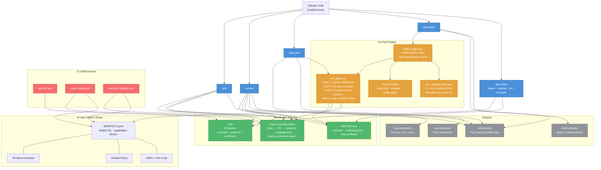
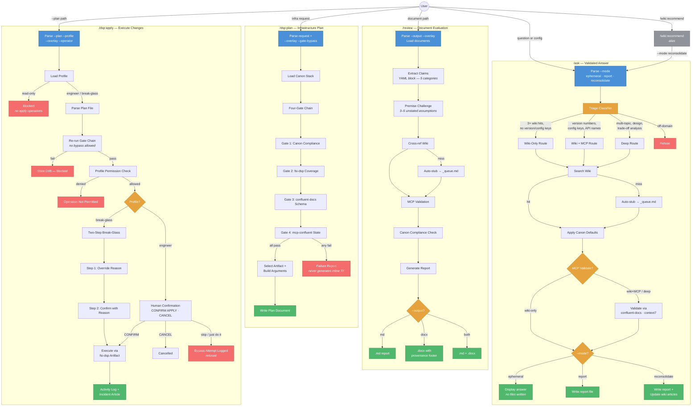

# cflt-ai — Confluent Operational & Knowledge Agent

A Confluent operational and knowledge agent for FSI engagements, built as Claude Code skills against a compounding wiki of validated canon. Three skills serve the engagement lifecycle: `/ask` for peer-level answers, `/review` for customer deliverables, and `/dsp:plan` + `/dsp:apply` for canon-compliant infrastructure operations through a four-gate act rail.

No custom application code. The "app" is Claude Code itself, configured via committed files.

## Quick Start

```bash
# 1. Clone (--recurse-submodules pulls fsi-dsp if you have access)
git clone --recurse-submodules git@github.com:goodlabs-studio/cflt-ai.git && cd cflt-ai

# 2. Activate the environment (installs Python, Node.js, etc.)
flox activate

# 3. Run first-time setup (auth, credentials, MCP config)
bin/setup

# 4. Start Claude Code
claude
```

That's it. Ask a question, paste a config, or run a skill.

## What You Can Do

### `/ask` — Get a validated answer

Paste a config snippet, error message, or architecture question. Claude searches the wiki, applies Confluent Canon defaults, and validates claims against live MCP sources. A triage classifier routes queries through wiki-only, wiki+MCP, or deep reasoning paths.

```
/ask What's the right acks setting for a transactional producer writing to a compacted topic?
```

Modes: `--mode ephemeral` (quick answer), `--mode report` (structured output), `--mode reconsolidate` (answer + write back to wiki). `/wiki:recommend` is an alias for `--mode reconsolidate`.

### `/review` — Evaluate a document

Point at a file and get a structured review with deterministic claim extraction, premise-challenge validation, and provenance-stamped output.

```
/review kafka-dr-framework-v3.md
```

Supports multi-document input (deck + tfvars + runbook as a single scope), customer overlays for differential canon, and `.docx` export with full provenance footer.

Output lands in `outputs/reports/<slug>-review-<date>.md`.

### `/dsp:plan` — Plan infrastructure changes (read-only)

Plan a Confluent infrastructure change through the four-gate validation chain. The agent selects an existing fsi-dsp artifact (never generates inline Terraform) and validates it against canon compliance, fsi-dsp coverage, confluent-docs schema, and mcp-confluent state.

```
/dsp:plan Create a compacted topic for customer events with Schema Registry
```

### `/dsp:apply` — Execute changes (human-gated)

Execute a planned change with mandatory human confirmation. Three policy profiles enforce least-privilege:

| Profile | Scope | Use Case |
|---------|-------|----------|
| `read-only` | Inspect only | Default for assessments |
| `engineer` | Create/modify within guardrails | Day-to-day operations |
| `break-glass` | Full access, two-step confirmation | Incident response |

Every apply is logged with full provenance and generates a wiki incident entry. 81 mcp-confluent tools are explicitly classified per profile — unclassified tools fail closed.

### Wiki Skills

| Skill | Purpose |
|-------|---------|
| `/wiki:ingest` | Compile raw sources into wiki articles with MCP validation |
| `/wiki:validate` | Check wiki claims against live Confluent docs, patch drift |
| `/wiki:recommend` | Answer questions using wiki + MCP, write back discoveries |
| `/wiki:lint` | Health check: stubs, broken links, orphans, stale articles |
| `/wiki:evaluate` | Full evaluation of external documents against wiki + MCP |

### CLI Tools

```bash
wiki-search "cluster linking DR"    # full-text search
wiki-lint --full                     # health check (includes decay audit)
wiki-stats                           # coverage metrics
wiki-compile --delta                 # process raw ingest queue
```

## Project Structure

```
cflt-ai/
├── .mcp.json                        # MCP server declarations
├── CLAUDE.md                        # Confluent Canon (auto-read by Claude Code)
├── .claude/
│   ├── settings.json                # Shared permission allowlist
│   ├── settings.local.json          # Personal overrides (gitignored)
│   └── commands/
│       ├── ask.md                   # /ask skill
│       ├── review.md                # /review skill
│       ├── dsp-plan.md              # /dsp:plan skill (act rail — plan)
│       ├── dsp-apply.md             # /dsp:apply skill (act rail — apply)
│       └── wiki/                    # Wiki skills (ingest, validate, etc.)
├── canon/                           # Four-layer overlay stack
│   ├── stack.py                     # Stack resolution engine
│   ├── base/defaults.yaml           # GoodLabs canonical defaults
│   ├── industry/fsi/overrides.yaml  # FSI-specific overrides
│   ├── customer/acme-bank/          # Customer overlay (demo)
│   │   ├── overrides.yaml
│   │   └── profiles/engineer.json   # Customer-specific profile gating
│   └── engagement/                  # Per-engagement overrides
├── wiki/
│   ├── _index.md                    # Master article index
│   ├── _graph.md                    # Backlink registry
│   ├── _queue.md                    # Auto-stub work queue
│   ├── activity/                    # Per-overlay activity logs
│   ├── incidents/                   # Apply incident entries
│   ├── concepts/                    # Foundational knowledge (11 articles)
│   ├── patterns/                    # Reusable architecture patterns (8 articles)
│   └── synthesis/                   # Cross-cutting analysis, ADR index
├── tools/                           # Python CLI tools + act rail engine
│   ├── act_gates.py                 # Four-gate validation chain
│   ├── apply_engine.py              # Apply execution with profile gating
│   ├── review-to-docx.py            # .docx export with provenance footer
│   ├── check-canon-parity.py        # Canon ↔ fsi-dsp drift detector
│   ├── check-citations.py           # Wiki citation resolver
│   ├── wiki-lint.py                 # Wiki linter with decay audit
│   ├── wiki-compile.py              # Raw source compiler
│   ├── wiki-search.py               # Full-text wiki search
│   ├── wiki-stats.py                # Coverage metrics
│   └── profiles/                    # Policy profile definitions
│       ├── read-only.json
│       ├── engineer.json
│       ├── break-glass.json
│       └── tool_classification.json # 81 mcp-confluent tools classified
├── tests/                           # Golden test harnesses + unit tests
│   ├── golden/ask/                  # 40+ /ask test cases
│   ├── golden/act/                  # 30+ /dsp:plan and /dsp:apply cases
│   ├── test_act_gates.py            # Four-gate unit tests
│   ├── test_apply_engine.py         # Apply engine + profile gating tests
│   ├── test_profile_gating.py       # Per-tool negative-space suites
│   └── ...                          # Canon overlay, citation, decay tests
├── raw/
│   └── repos/fsi-dsp/              # Git submodule: Terraform, Ansible, ADRs
├── outputs/                         # Generated reports and .docx files
├── bin/
│   └── setup                        # First-run setup script
└── .github/
    └── workflows/
        ├── wiki-lint.yml            # CI lint for wiki PRs
        ├── canon-parity.yml         # Canon ↔ fsi-dsp drift CI
        └── manifest-citations.yml   # Citation resolution CI
```

## How It Works



**Skills** combine these sources: the wiki provides institutional knowledge, the canon overlay stack provides layered defaults (base → industry → customer → engagement), MCP servers provide live validation, and fsi-dsp provides the artifact library that the act rail operates against.

**The act rail** never generates infrastructure code. It selects existing fsi-dsp artifacts through a four-gate chain (canon compliance → fsi-dsp coverage → schema validation → state check), applies profile-based least-privilege gating, and executes only after explicit human confirmation.

## Skill Flows



## Canon Overlay Stack

The canon overlay stack lets customers fork and override safely:

```
base/defaults.yaml          # GoodLabs canonical Confluent defaults
  └─ industry/fsi/          # FSI: latency SLA tiers, exactly-once for reg reporting
      └─ customer/acme-bank/ # Acme Bank: zstd compression, sub-100μs latency floor
          └─ engagement/     # Per-engagement overrides (ephemeral)
```

Each layer overrides the layer above. Every override is an ADR in the layer that introduces it. The active stack hash is recorded in every artifact's provenance footer.

## fsi-dsp Reference Repo (Optional)

The [fsi-dsp](https://github.com/goodlabs-studio/fsi-dsp) repo is linked as a git submodule at `raw/repos/fsi-dsp/`. It contains Terraform modules, Ansible roles, ADRs, and reference implementations. MANIFEST.yaml is the binding contract — cflt-ai cites artifacts by stable ID; CI in both repos enforces ID stability and citation resolution.

`bin/setup` offers to initialize it. You can also do it manually:

```bash
git submodule update --init raw/repos/fsi-dsp
```

Requires SSH access to `goodlabs-studio/fsi-dsp`. Without it, wiki and knowledge skills still work — the act rail (`/dsp:plan`, `/dsp:apply`) requires it.

## Confluent Cloud Integration (Optional)

The `mcp-confluent` server lets Claude query live Confluent Cloud clusters (topics, schemas, Flink SQL). Setup during `bin/setup`, or manually:

```bash
mkdir -p ~/.config/confluent
cat > ~/.config/confluent/mcp.env << 'EOF'
CONFLUENT_CLOUD_API_KEY=<your-key>
CONFLUENT_CLOUD_API_SECRET=<your-secret>
EOF
export CONFLUENT_MCP_ENV_FILE=~/.config/confluent/mcp.env
```

Without CC credentials, the wiki and skills still work — you just can't query live clusters or run gate 4 (state check) of the act rail.

## Contributing

See [CONTRIBUTING.md](CONTRIBUTING.md) for the full guide. The short version:

1. Branch from `main`
2. Add/modify wiki articles, run `/wiki:lint`
3. Open a PR — CI validates wiki structure, citation resolution, and canon parity automatically
4. Note which claims were MCP-validated in the PR description

## Requirements

- **[Flox](https://flox.dev)** — manages the dev environment (Python, Node.js, etc.)
- **Claude Code** — installed separately via `npm install -g @anthropic-ai/claude-code` or Homebrew
- **Claude auth** — either a Claude Max/Pro subscription or an Anthropic API key
