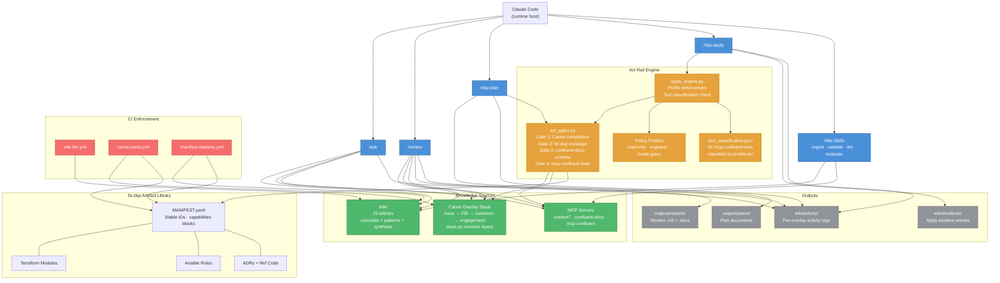
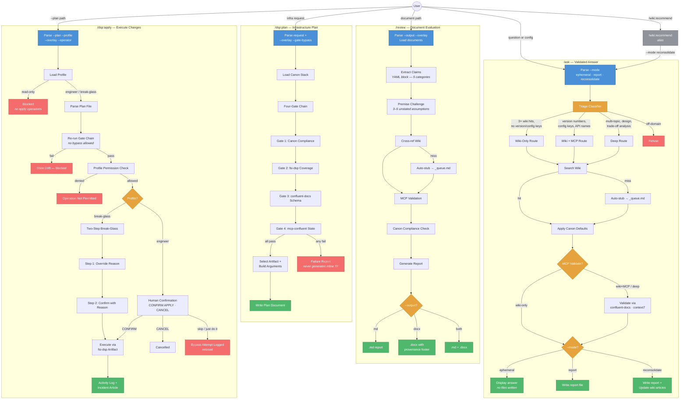

# cflt-ai Diagrams

## Architecture

```mermaid
graph TD
    CC["Claude Code<br/>(runtime host)"]

    CC --> ASK["/ask"]
    CC --> REV["/review"]
    CC --> PLAN["/dsp:plan"]
    CC --> APPLY["/dsp:apply"]
    CC --> WS["Wiki Skills<br/>ingest · validate · lint · evaluate"]

    subgraph sources["Knowledge Sources"]
        WIKI["Wiki<br/>20 articles<br/>concepts + patterns + synthesis"]
        CANON["Canon Overlay Stack<br/>base → FSI → customer → engagement<br/><i>stack.py resolves layers</i>"]
        MCP["MCP Servers<br/>context7 · confluent-docs · mcp-confluent"]
    end

    ASK --> WIKI & CANON & MCP
    REV --> WIKI & CANON & MCP
    WS --> WIKI & MCP

    subgraph actrail["Act Rail Engine"]
        GATES["act_gates.py<br/>Gate 1: Canon compliance<br/>Gate 2: fsi-dsp coverage<br/>Gate 3: confluent-docs schema<br/>Gate 4: mcp-confluent state"]
        ENGINE["apply_engine.py<br/>Profile enforcement<br/>Tool classification check"]
        PROFILES["Policy Profiles<br/>read-only · engineer · break-glass"]
        TOOLCLASS["tool_classification.json<br/>81 mcp-confluent tools<br/>classified by profile tier"]
    end

    PLAN --> GATES
    APPLY --> ENGINE --> GATES
    ENGINE --> PROFILES & TOOLCLASS
    GATES --> CANON & MCP

    subgraph artifacts["fsi-dsp Artifact Library"]
        MANIFEST["MANIFEST.yaml<br/>Stable IDs · capabilities blocks"]
        TF["Terraform Modules"]
        ANSIBLE["Ansible Roles"]
        ADRS["ADRs + Ref Code"]
    end

    GATES --> MANIFEST
    MANIFEST --- TF & ANSIBLE & ADRS

    subgraph outputs["Outputs"]
        REPORTS["outputs/reports/<br/>Review .md + .docx"]
        PLANS["outputs/plans/<br/>Plan documents"]
        ACTIVITY["wiki/activity/<br/>Per-overlay activity logs"]
        INCIDENTS["wiki/incidents/<br/>Apply incident articles"]
    end

    REV --> REPORTS
    PLAN --> PLANS
    APPLY --> INCIDENTS
    ASK & REV & PLAN & APPLY --> ACTIVITY

    subgraph ci["CI Enforcement"]
        WL["wiki-lint.yml"]
        CP["canon-parity.yml"]
        MC["manifest-citations.yml"]
    end

    WL --> WIKI
    CP --> CANON & MANIFEST
    MC --> WIKI & MANIFEST

    classDef skill fill:#4a90d9,color:#fff,stroke:#2c5f8a
    classDef source fill:#50b86c,color:#fff,stroke:#2d7a42
    classDef engine fill:#e6a23c,color:#fff,stroke:#b8860b
    classDef output fill:#909399,color:#fff,stroke:#606266
    classDef cinode fill:#f56c6c,color:#fff,stroke:#c0392b

    class ASK,REV,PLAN,APPLY,WS skill
    class WIKI,CANON,MCP source
    class GATES,ENGINE,PROFILES,TOOLCLASS engine
    class REPORTS,PLANS,ACTIVITY,INCIDENTS output
    class WL,CP,MC cinode
```

## Skill Flows

```mermaid
flowchart TD
    USER((User))

    USER -->|question or config| ASK_START
    USER -->|document path| REV_START
    USER -->|"/wiki:recommend"| ALIAS
    USER -->|infra request| PLAN_START
    USER -->|"--plan path"| APPLY_START

    ALIAS["/wiki:recommend<br/><i>alias</i>"] -->|"--mode reconsolidate"| ASK_START

    subgraph ask["/ask — Validated Answer"]
        ASK_START["Parse --mode<br/>ephemeral · report · reconsolidate"]
        ASK_START --> TRIAGE["Triage Classifier"]
        TRIAGE -->|"3+ wiki hits,<br/>no version/config keys"| WIKI_ONLY["Wiki-Only Route"]
        TRIAGE -->|"version numbers,<br/>config keys, API names"| WIKI_MCP["Wiki + MCP Route"]
        TRIAGE -->|"multi-topic, design,<br/>trade-off analysis"| DEEP["Deep Route"]
        TRIAGE -->|"off-domain"| REFUSE["Refuse"]

        WIKI_ONLY --> WSEARCH["Search Wiki"]
        WIKI_MCP --> WSEARCH
        DEEP --> WSEARCH

        WSEARCH -->|miss| STUB["Auto-stub → _queue.md"]
        WSEARCH -->|hit| CANON_CHK["Apply Canon Defaults"]
        STUB --> CANON_CHK

        CANON_CHK --> MCP_VAL{"MCP Validate?"}
        MCP_VAL -->|"wiki-only"| MODE
        MCP_VAL -->|"wiki+MCP / deep"| VALIDATE["Validate via<br/>confluent-docs · context7"] --> MODE

        MODE{"--mode?"}
        MODE -->|ephemeral| DISPLAY["Display answer<br/><i>no files written</i>"]
        MODE -->|report| WRITE_RPT["Write report file"]
        MODE -->|reconsolidate| WRITE_RECON["Write report +<br/>Update wiki articles"]
    end

    subgraph review["/review — Document Evaluation"]
        REV_START["Parse --output --overlay<br/>Load documents"]
        REV_START --> EXTRACT["Extract Claims<br/><i>YAML block — 5 categories</i>"]
        EXTRACT --> PREMISE["Premise Challenge<br/><i>3–5 unstated assumptions</i>"]
        PREMISE --> WIKI_XREF["Cross-ref Wiki"]
        WIKI_XREF -->|miss| STUB2["Auto-stub → _queue.md"]
        WIKI_XREF --> MCP_CHK["MCP Validation"]
        STUB2 --> MCP_CHK
        MCP_CHK --> CANON_CMP["Canon Compliance Check"]
        CANON_CMP --> GEN_RPT["Generate Report"]
        GEN_RPT --> OUTPUT{"--output?"}
        OUTPUT -->|md| MD_OUT[".md report"]
        OUTPUT -->|docx| DOCX_OUT[".docx with<br/>provenance footer"]
        OUTPUT -->|both| BOTH_OUT[".md + .docx"]
    end

    subgraph plan["/dsp:plan — Infrastructure Plan"]
        PLAN_START["Parse request +<br/>--overlay --gate-bypass"]
        PLAN_START --> LOAD_CANON["Load Canon Stack"]
        LOAD_CANON --> GATE_CHAIN["Four-Gate Chain"]

        GATE_CHAIN --> G1["Gate 1: Canon Compliance"]
        G1 --> G2["Gate 2: fsi-dsp Coverage"]
        G2 --> G3["Gate 3: confluent-docs Schema"]
        G3 --> G4["Gate 4: mcp-confluent State"]

        G4 -->|all pass| SELECT["Select Artifact +<br/>Build Arguments"]
        G4 -->|any fail| FAIL_PLAN["Failure Report<br/><i>never generates inline TF</i>"]
        SELECT --> WRITE_PLAN["Write Plan Document"]
    end

    subgraph apply["/dsp:apply — Execute Changes"]
        APPLY_START["Parse --plan --profile<br/>--overlay --operator"]
        APPLY_START --> LOAD_PROF["Load Profile"]

        LOAD_PROF -->|read-only| BLOCKED["Blocked<br/><i>no apply operations</i>"]
        LOAD_PROF -->|engineer / break-glass| PARSE_PLAN["Parse Plan File"]

        PARSE_PLAN --> RERUN["Re-run Gate Chain<br/><i>no bypass allowed</i>"]
        RERUN -->|fail| DRIFT["State Drift — Blocked"]
        RERUN -->|pass| PERM_CHK["Profile Permission Check"]

        PERM_CHK -->|denied| PERM_DENY["Operation Not Permitted"]
        PERM_CHK -->|allowed| PROFILE_CHK{"Profile?"}

        PROFILE_CHK -->|engineer| CONFIRM["Human Confirmation<br/>CONFIRM APPLY · CANCEL"]
        PROFILE_CHK -->|break-glass| BG_FLOW["Two-Step Break-Glass"]
        BG_FLOW --> BG1["Step 1: Override Reason"]
        BG1 --> BG2["Step 2: Confirm with Reason"]
        BG2 --> EXEC

        CONFIRM -->|CONFIRM| EXEC["Execute via<br/>fsi-dsp Artifact"]
        CONFIRM -->|CANCEL| CANCELLED["Cancelled"]
        CONFIRM -->|"skip / just do it"| BYPASS_LOG["Bypass Attempt Logged<br/><i>refused</i>"]

        EXEC --> LOG["Activity Log +<br/>Incident Article"]
    end

    classDef start fill:#4a90d9,color:#fff,stroke:#2c5f8a
    classDef decision fill:#e6a23c,color:#fff,stroke:#b8860b
    classDef block fill:#f56c6c,color:#fff,stroke:#c0392b
    classDef output fill:#50b86c,color:#fff,stroke:#2d7a42
    classDef alias fill:#909399,color:#fff,stroke:#606266

    class ASK_START,REV_START,PLAN_START,APPLY_START start
    class TRIAGE,MODE,OUTPUT,MCP_VAL,PROFILE_CHK decision
    class BLOCKED,DRIFT,PERM_DENY,BYPASS_LOG,REFUSE,FAIL_PLAN block
    class DISPLAY,WRITE_RPT,WRITE_RECON,MD_OUT,DOCX_OUT,BOTH_OUT,WRITE_PLAN,LOG output
    class ALIAS alias
```
