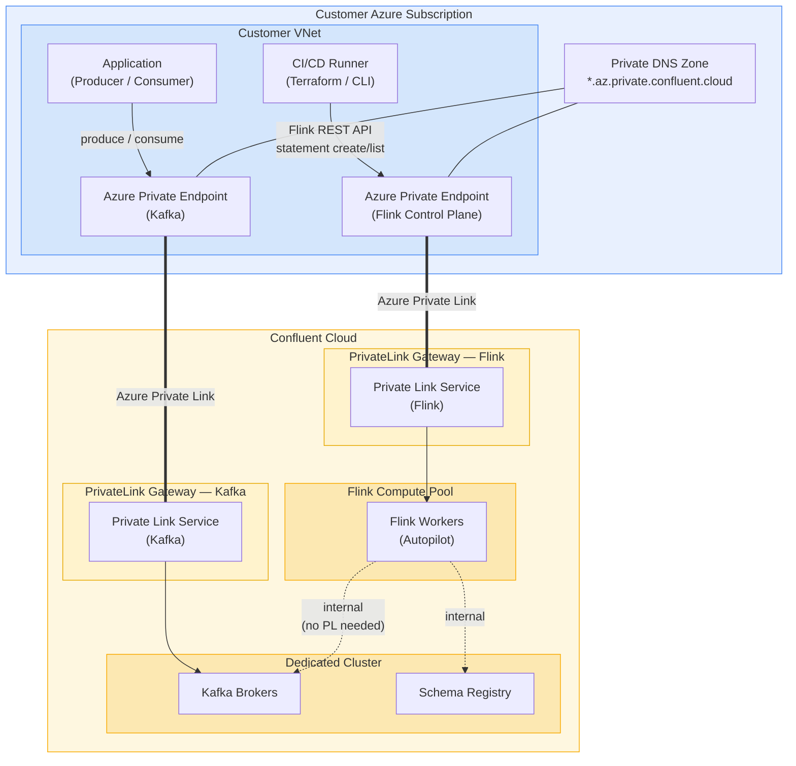
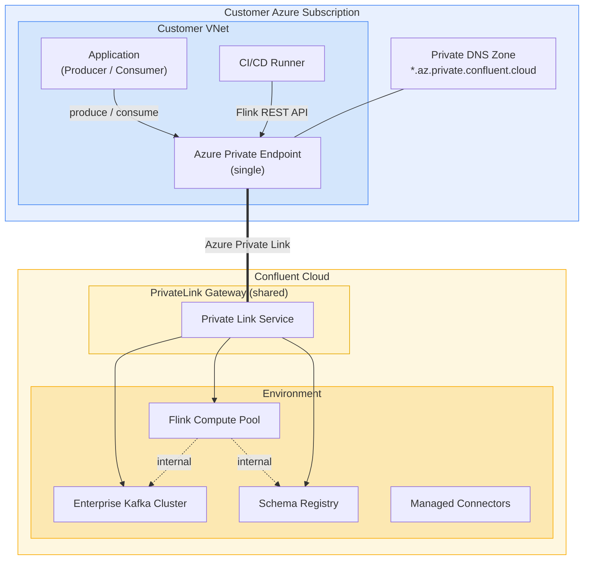

# Flink + Private Link Architecture Diagrams

## Diagram 1: Dedicated Cluster — Dual Private Link Gateway

Dedicated clusters require **separate** PrivateLink gateways for Kafka and Flink.
Flink-to-Kafka traffic is internal (never traverses PL).



**Key points:**
- Two separate Azure Private Endpoints, each targeting a different Confluent PL Service alias
- Flink-to-Kafka is always internal — never goes through customer PL
- Both PEs share the same Private DNS Zone

---

## Diagram 2: Enterprise Cluster — Single Private Link Gateway

Enterprise clusters reuse **one** PrivateLink Gateway for all serverless products
(Kafka, Flink, Schema Registry, Connect).



**Key point:** One PE, one PL Service, one gateway — covers everything.

---

## Diagram 3: DevOps Flow — Flink SQL Deployment via Private Link

Developers cannot use CLI or Console directly. All Flink SQL is deployed through
a CI/CD pipeline that hits the Confluent REST API over PrivateLink.

```mermaid
graph LR
    subgraph dev["Developer Workstation"]
        code["Flink SQL files<br/>(version controlled)"]
    end

    subgraph git["Git Repository"]
        repo["sql/<br/>├── create_tables.sql<br/>├── filter_orders.sql<br/>└── aggregate_risk.sql"]
        tf["terraform/<br/>├── flink_statements.tf<br/>└── topics.tf"]
    end

    subgraph cicd["CI/CD Pipeline<br/>(GitHub Actions / Azure DevOps)"]
        subgraph runner["Self-Hosted Runner<br/>(in Customer VNet)"]
            validate["1. Validate SQL syntax"]
            plan["2. terraform plan"]
            apply["3. terraform apply<br/>or confluent flink<br/>statement create"]
        end
    end

    subgraph azure["Customer VNet"]
        pe["Azure Private<br/>Endpoint"]
    end

    subgraph cc["Confluent Cloud"]
        pls["PrivateLink<br/>Gateway"]
        api["Flink REST API"]
        pool["Flink Compute Pool"]
        kafka["Kafka Topics"]
    end

    code -->|"git push"| repo
    repo -->|"trigger"| validate
    validate --> plan
    plan --> apply
    apply -->|"API call"| pe
    pe ===|"Private Link"| pls
    pls --> api
    api --> pool
    pool -.->|"read/write<br/>(internal)"| kafka

    style dev fill:#f0f0f0,stroke:#666
    style git fill:#f5f0ff,stroke:#7c3aed
    style cicd fill:#e8f5e9,stroke:#2e7d32
    style runner fill:#c8e6c9,stroke:#2e7d32
    style azure fill:#e8f0fe,stroke:#4285f4
    style cc fill:#fef7e0,stroke:#f9ab00
```



**Key points:**
- Developers never touch Confluent Cloud directly — no CLI, no Console access
- SQL statements are version-controlled alongside Terraform configs
- CI/CD runner is a self-hosted agent inside the customer VNet (required for PL access)
- Runner calls Confluent REST API or `confluent flink statement create` via the Private Endpoint
- Terraform `confluent_flink_statement` resource is the cleanest approach for IaC
- Flink-to-Kafka remains internal regardless of how the statement was submitted

### Terraform Example (statement deployment)

```hcl
resource "confluent_flink_statement" "filter_orders" {
  organization {
    id = var.confluent_org_id
  }
  environment {
    id = var.confluent_env_id
  }
  compute_pool {
    id = confluent_flink_compute_pool.prod.id
  }

  principal {
    id = confluent_service_account.flink_sa.id
  }

  statement     = file("${path.module}/sql/filter_orders.sql")
  statement_name = "filter-orders-prod"

  properties = {
    "sql.current-catalog"  = var.confluent_env_id
    "sql.current-database" = confluent_kafka_cluster.prod.id
  }
}
```

### REST API Example (direct API call from pipeline)

```bash
# From CI/CD runner inside customer VNet
curl -X POST "https://flink.az.private.confluent.cloud/sql/v1/organizations/${ORG_ID}/environments/${ENV_ID}/statements" \
  -H "Authorization: Bearer ${CONFLUENT_CLOUD_API_KEY}" \
  -H "Content-Type: application/json" \
  -d '{
    "name": "filter-orders-prod",
    "spec": {
      "statement": "INSERT INTO domain.orders.filtered SELECT * FROM raw.events.ingested WHERE event_type = '\''order.placed'\''",
      "compute_pool_id": "'"${POOL_ID}"'",
      "principal": "'"${SERVICE_ACCOUNT_ID}"'"
    }
  }'
```
