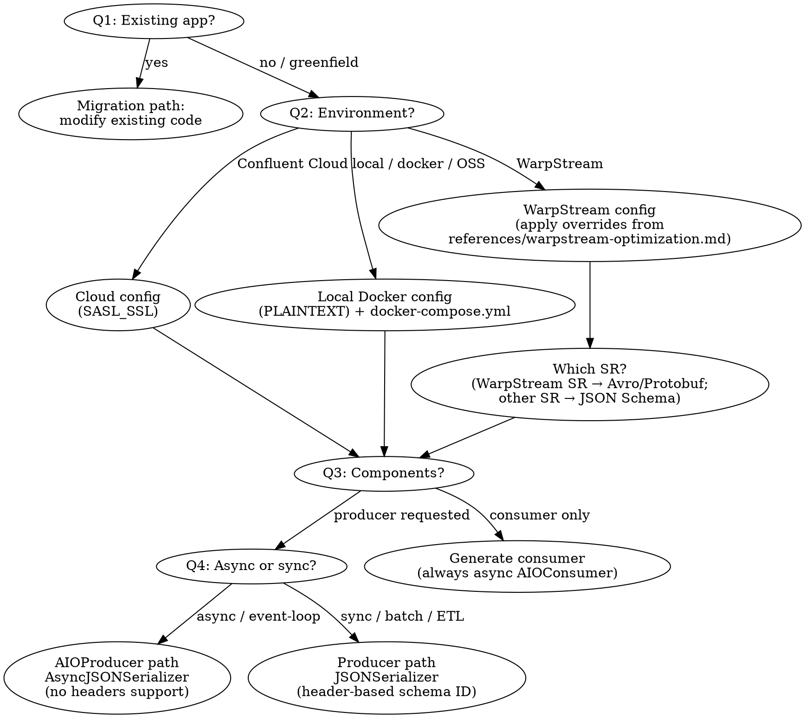

<HARD-GATE>
Do NOT generate any code, scaffold any project, or modify any file until you have
explicitly asked and received answers for questions #1 (existing app or greenfield),
#2 (target environment), and #3 (producer, consumer, or both). If the user's prompt
partially answers some questions, still confirm your understanding before generating.
This applies to EVERY prompt regardless of how specific it appears.
</HARD-GATE>

Begin by announcing: "Using the Confluent Kafka Python Client skill to guide this project."

# Confluent Kafka Python Client Creation

Generate a production-ready Python project for producing to and/or consuming from Kafka using `confluent-kafka-python`. Supports three target environments: **Confluent Cloud** (managed), **Local Docker** (open-source Kafka), and **WarpStream** (Kafka-compatible, object-storage-backed), and two producer styles: **AsyncIO** (non-blocking) and **Synchronous** (blocking). The generated code follows Confluent's best practices.

## Step 1: Gather Requirements

Before generating any code, work through the questions below. **Skip any question the user has already answered explicitly in their prompt** — do not re-ask just for form's sake. For example, "build a producer and consumer on Confluent Cloud with an async producer" already answers #2, #3, and #4; only #1, #5, #6, #7, and #8 remain.

**Mandatory confirmation gate — do not skip, even if the user answered every question.** Before writing any file, you MUST send one message that:
1. Recaps the answers you extracted as a short bulleted list (e.g., "Target: Confluent Cloud · Components: producer + consumer · Producer style: async · From scratch: yes").
2. Asks any remaining open questions inline.
3. Explicitly asks the user to confirm or correct before you proceed.

Then STOP and wait for the user's reply. Do not generate files in the same turn as the recap, and do not proceed on the assumption that a fully-specified prompt implies consent to generate immediately — the recap catches misinterpretations of the prompt and is required even when questions #1–#8 are all pre-answered. The only way to skip the gate is if the user has already confirmed the recap earlier in this conversation.

Do not assume defaults for #1, #2, or #3 — if any of these are not answered by the prompt, you must ask.

1. **Are you adding Kafka to an existing application, or starting from scratch?**
   - If the user has existing Python code (mentions an existing project, has a `main.py`, uses Flask/FastAPI/Django, etc.), do **not** scaffold a new project. Instead: (a) identify their existing producer or data-sending code, (b) ask whether they already have schemas registered in Schema Registry, (c) add Schema Registry integration to their existing code following the patterns in the reference files. Generate only the files they are missing (e.g., `common.py`, `schemas/value.schema.json`) and modify their existing code inline.
   - If the user already produces to Kafka without Schema Registry (schemaless), help them migrate: (1) generate a JSON Schema from their existing message structure, (2) register it, and (3) replace their raw `producer.produce()` calls with serializer-backed calls. Do not discard their existing code.
   - If starting from scratch, proceed with the full scaffold below.
2. **Target environment?** — Confluent Cloud, local Kafka (Docker), or WarpStream. **Always prompt for this, even if the user didn't mention it.** If they mention "open source", "local", "docker", "self-hosted", or just want to try Kafka without a cloud account, choose **local Docker**. If they mention "Confluent Cloud", "CC", or have existing cloud credentials, choose **Confluent Cloud**. If they mention "WarpStream", choose **WarpStream**. Default to Confluent Cloud if they confirm they don't have a preference, but always ask first.
   - **If WarpStream:** Read `references/warpstream-optimization.md` and apply the librdkafka overrides from that reference. Key changes: disable idempotence, dramatically increase batch sizes and in-flight requests, set large fetch sizes, add `ws_az=<az>` to `client.id` for zone-aware routing. Prefer null message keys for sticky partitioning unless entity-based ordering is required.
3. **Producer, consumer, or both?**
4. **Async or synchronous producer?** (Only if producer is requested.) Help the user choose:
   - **AsyncIO Producer** (`AIOProducer`): Use when code runs under an event loop — FastAPI/Starlette, aiohttp, Sanic, asyncio workers — and must not block.
   - **Synchronous Producer** (`Producer`): Use for scripts, batch jobs, and highest-throughput pipelines where the user controls threads/processes and can call `poll()`/`flush()` directly.
   If the user mentions an async framework (FastAPI, aiohttp, Sanic) or uses `asyncio`, default to **AsyncIO**. If they mention scripts, batch, ETL, or don't have a preference, default to **Synchronous**.
5. **Do you have an existing schema you'd like to use?** If yes, ask the user to paste it or provide the file path, then use it as the `schemas/value.schema.json` instead of generating one. If no, proceed to ask about their data fields.
6. **What kind of data are you producing?** (Only if the user doesn't have an existing schema. Get field names and types so you can generate a matching JSON Schema and sample data.)
7. **Topic name?** (Default: `demo-topic`)
8. **Consumer group ID?** (Only if consumer; default: `python-consumer-group`)

Don't ask about Schema Registry — always include it. For Confluent Cloud and local Docker, always use JSON Schema. If the target is WarpStream, ask which Schema Registry implementation they are using — WarpStream's built-in schema registry only supports Avro and Protobuf (`GET /schemas/types` returns `["AVRO","PROTOBUF"]`), so if they are using it, ask whether they prefer Avro or Protobuf (default to Avro). If they are using a different SR (e.g., Confluent Cloud Schema Registry), JSON Schema is fine.

### Common Agent Mistakes

| Thought | Reality |
|---------|---------|
| "The user mentioned FastAPI, so I know it's async — skip the questions" | Still confirm. They might want a sync background worker alongside FastAPI. |
| "I'll use Avro since it's more widely used" | This skill uses JSON Schema by default. **Exception:** WarpStream's built-in schema registry only supports Avro and Protobuf — if the user is using WarpStream SR, use Avro by default. If they're using a different SR (e.g., Confluent Cloud SR), JSON Schema is fine regardless of the Kafka environment. |
| "I'll skip Schema Registry to keep it simple" | Schema Registry is non-negotiable. Every project includes it. |
| "I'll use `auto.register.schemas=True` for convenience" | Always `False`. Explicit registration is a core principle. |
| "I'll create a producer in `produce()` — it's cleaner" | One producer instance, created in `main()`, passed as a parameter. Always. |
| "The user wants sync, so the consumer should be sync too" | Consumer is always async (`AIOConsumer`). This is a deliberate design decision. |
| "I'll add `headers=` to the AIOProducer for schema ID" | `AIOProducer.produce()` raises `NotImplementedError` on headers. Only sync producers use headers. |
| "I'll swap `AsyncJSONSerializer` for `AsyncAvroSerializer` and keep the call site the same" | `JSONSerializer` takes `schema_str` first; `AvroSerializer` takes `schema_registry_client` first. Calling positionally across formats raises `TypeError: ... got multiple values for argument 'schema_registry_client'`. Always pass both as kwargs. |
| "I'll set `message.max.bytes=64000000` on the producer config and `fetch.max.bytes=50242880` on the consumer — they're independent" | Not in librdkafka. `message.max.bytes` is a **client-global** config (unlike Java's per-role `max.request.size`), so when `get_kafka_config()` is shared between producer and consumer, the consumer inherits it. librdkafka enforces `fetch.max.bytes >= message.max.bytes` at consumer construction and raises `KafkaError{_INVALID_ARG, ... "fetch.max.bytes must be >= message.max.bytes"}`. Use the WarpStream librdkafka consumer values in `references/warpstream-optimization.md` (`fetch.max.bytes=67108864`) — they're sized to satisfy this constraint. |

## Step 1b: Confirm Understanding

After gathering all answers, present a confirmation summary before generating any code:

```
Before I generate the project, let me confirm:
- Project type: [Greenfield scaffold / Migration of existing code]
- Environment: [Confluent Cloud (SASL_SSL) / Local Docker (PLAINTEXT) / WarpStream]
- Schema format: [JSON Schema / Avro / Protobuf] (Avro or Protobuf if using WarpStream's built-in SR)
- Components: [Producer only / Consumer only / Both]
- Producer style: [AsyncIO (AIOProducer) / Synchronous (Producer)] (if applicable)
- Schema: [brief description of user's data fields]
- Topic: [topic name]
- Consumer group: [group ID] (if consumer)

Does this look right?
```

Wait for user confirmation before proceeding to Step 2. If the user corrects anything, update your understanding and re-confirm.

## Step 2: Generate the Project

### Decision Flowchart



Create this file structure in the user's chosen directory:

```
<project-dir>/
├── producer.py          # (if requested)
├── consumer.py          # (if requested)
├── common.py            # shared config loading + verification helpers
├── schemas/
│   └── value.schema.json # JSON Schema (or value.avsc / value.proto when using WarpStream SR)
├── tests/
│   └── test_project.py  # unit tests (always generated)
├── .env.example         # template for credentials
├── requirements.txt
├── docker-compose.yml   # (local Docker path only)
```

### Security

NEVER read, open, or display `.env` files. They contain API keys and secrets. Only generate `.env.example` with placeholder values. If the user asks you to debug a connection issue, ask them to verify their `.env` values themselves — do not read the file.

### Core Principles

These principles matter because they prevent the most common production issues with Kafka Python clients:

1. **Reuse the producer instance.** Creating a new producer per message is expensive — each one opens new TCP connections, does SASL handshakes, and fetches metadata. Create one producer and reuse it for all messages. The produce function should accept the producer as a parameter, not instantiate one.

2. **Always use Schema Registry with JSON Schema.** Schema Registry enforces a contract between producers and consumers. Without it, schema changes silently break downstream consumers. This skill uses **JSON Schema** by default. Schema Registry supports Avro, Protobuf, and JSON Schema — JSON Schema is chosen because: (1) Python has first-class JSON support with no code generation step, (2) `confluent-kafka-python` provides `JSONSerializer`/`JSONDeserializer` out of the box, (3) it is the most approachable format for Python developers already working with JSON/dict data.

   **WarpStream Schema Registry exception:** WarpStream's built-in schema registry only supports Avro and Protobuf — its `GET /schemas/types` endpoint returns `["AVRO","PROTOBUF"]`. JSON Schema is **not available** when using WarpStream's SR. If the user is running WarpStream and using its built-in SR, use **Avro** by default (or Protobuf if the user prefers). Use `AvroSerializer`/`AvroDeserializer` from `confluent_kafka.schema_registry.avro` (or `ProtobufSerializer`/`ProtobufDeserializer` from `confluent_kafka.schema_registry.protobuf`). For async producers, use `AsyncAvroSerializer` from `confluent_kafka.schema_registry._async.avro` (or `AsyncProtobufSerializer` from `confluent_kafka.schema_registry._async.protobuf`). Generate an Avro schema file at `schemas/value.avsc` (or `schemas/value.proto` for Protobuf) instead of `schemas/value.schema.json` — use `references/value.avsc` as the starting point and adapt to the user's domain. When generating producer/consumer code on the Avro path, copy from `references/producer_avro.py` (async), `references/producer_avro_sync.py` (sync), and `references/consumer_avro.py` (async) — **not** the JSON reference files — because the constructor signatures differ (see the Avro constructor warning below). If the user is running WarpStream but pointing at a different SR (e.g., Confluent Cloud Schema Registry), JSON Schema works fine — use the default path.

   **Register schemas as a separate explicit step** before creating the serializer. Use a dedicated `register_schema()` function that calls `sr_client.register_schema()` and lets errors (auth failures, network errors, permission denials) propagate immediately — never wrap registration in a bare `try/except`. Then configure the serializer with `auto.register.schemas=False` and `use.latest.version=True`. This ensures the serializer never silently auto-registers and aligns with production practice where CI/CD registers schemas, not application startup.

   Use the appropriate serializer for the chosen producer style and schema format:
   - **JSON Schema (default):** `AsyncJSONSerializer` / `AsyncJSONDeserializer` from `confluent_kafka.schema_registry._async.json_schema` for async, or `JSONSerializer` / `JSONDeserializer` from `confluent_kafka.schema_registry.json_schema` for synchronous.
   - **Avro (default when using WarpStream SR):** `AsyncAvroSerializer` / `AsyncAvroDeserializer` from `confluent_kafka.schema_registry._async.avro` for async, or `AvroSerializer` / `AvroDeserializer` from `confluent_kafka.schema_registry.avro` for synchronous.
   - **Protobuf (alternative when using WarpStream SR):** `AsyncProtobufSerializer` / `AsyncProtobufDeserializer` from `confluent_kafka.schema_registry._async.protobuf` for async, or `ProtobufSerializer` / `ProtobufDeserializer` from `confluent_kafka.schema_registry.protobuf` for synchronous.

3. **Choose the right producer style.** The `confluent-kafka-python` library offers two producer APIs:
   - **AsyncIO Producer** (`AIOProducer` from `confluent_kafka.aio`): Non-blocking, integrates with `asyncio` event loops. Use with `AsyncJSONSerializer` from `confluent_kafka.schema_registry._async.json_schema` and `AsyncSchemaRegistryClient`. Best for applications already running an event loop (FastAPI, aiohttp, Sanic, asyncio workers).
   - **Synchronous Producer** (`Producer` from `confluent_kafka`): Blocking calls with delivery callbacks. Use with `JSONSerializer` from `confluent_kafka.schema_registry.json_schema` and `SchemaRegistryClient`. Best for scripts, batch jobs, and highest-throughput pipelines where the user controls threads/processes and can call `poll()`/`flush()` directly.
   Always ask the user which style fits their use case. The consumer always uses `AIOConsumer` (async) — long-running poll loops benefit from non-blocking I/O, and mixing sync/async consumer styles adds complexity with little benefit.

4. **Graceful shutdown.** Async producers must `flush()` and `close()` (both awaited) before exiting. Synchronous producers must call `flush()` before exiting — otherwise buffered messages are lost. Consumers must `unsubscribe()` then `close()` to leave the consumer group cleanly (avoiding unnecessary rebalances). Use `try/finally` blocks and handle `KeyboardInterrupt` / signals.

5. **Support Confluent Cloud, local Docker, and WarpStream.** When targeting Confluent Cloud, configure `SASL_SSL` with `PLAIN` mechanism and load API keys from `.env`. When targeting local Docker, use `PLAINTEXT` with no authentication. When targeting WarpStream, use `SASL_SSL` or `PLAINTEXT` depending on the user's WarpStream deployment, and apply the librdkafka overrides from `references/warpstream-optimization.md` (large batches, disabled idempotence, large fetches, zone-aware `client.id`). The `KAFKA_ENV` environment variable (`cloud`, `local`, or `warpstream`) controls which path is used. Load all settings from environment variables via `.env`.

6. **Verify connectivity before running.** Use `AdminClient.list_topics()` to verify the broker is reachable and the topic exists before producing or consuming. Verify Schema Registry connectivity with an HTTP health check.

7. **Always set a message key for domain events.** Pass `key=<entity_id>.encode("utf-8")` to `producer.produce()` for any message that represents an entity or event stream (order events, user actions, device telemetry, transactions). Kafka partitions by key, so messages with the same key land on the same partition and preserve ordering — critical for event streams like `OrderCreated → OrderUpdated → OrderCancelled` where consumers must see events in order. The `produce()` helper in every reference file accepts a `key_field` parameter naming the field to use as the key (e.g., `key_field="order_id"`, `key_field="transaction_id"`). Ask the user which field identifies the entity and pass it to `produce()`. Only leave `key_field=None` if the user explicitly states ordering does not matter (e.g., stateless metrics where any partition is fine).

   **WarpStream exception:** On WarpStream, null keys enable sticky partitioning, which builds larger batches and significantly improves throughput and cost. When the user's use case does **not** require per-entity ordering (e.g., independent telemetry readings, stateless metrics, logs), recommend `key_field=None` and explain the throughput benefit. When per-entity ordering **is** required (e.g., `OrderCreated → OrderUpdated → OrderCancelled` for the same order), still set a message key — correctness takes priority over batching efficiency. Ask the user whether their events need per-key ordering to decide.

### common.py

This module handles configuration loading and connectivity verification. Use `references/common.py` as the template.

### producer.py Pattern (AsyncIO)

When the user chooses the **AsyncIO producer**, use `references/producer.py` as the template.

Key points:
- `produce()` takes a producer instance as a parameter — it never creates one
- The producer is created once in `main()` and can be passed to multiple `produce()` calls
- The async serializer (`AsyncJSONSerializer`) must be `await`ed when calling it on a message
- `AIOProducer.produce()` is async and returns an `asyncio.Future`. You must `await` the method to get the Future, then `await` the Future to get the delivered `Message`: `future = await producer.produce(...); result = await future`
- `AIOProducer.flush()` and `close()` are coroutines — they must be `await`ed in the `finally` block
- Signal handlers set a shutdown event for graceful termination
- Schema registration and serializer creation are separate steps. `register_schema()` explicitly registers the schema and returns the schema ID — errors propagate immediately. `create_json_serializer()` (or `create_avro_serializer()` / `create_protobuf_serializer()` when using Avro/Protobuf) creates the serializer with `conf={'auto.register.schemas': False, 'use.latest.version': True}`.
- **Constructor argument order differs across formats — always pass `schema_registry_client` and `schema_str` as keyword arguments, never positionally.** The JSON, Avro, and Protobuf serializer/deserializer classes in `confluent-kafka-python` do **not** share the same positional signature: `JSONSerializer`/`JSONDeserializer` take `schema_str` first, while `AvroSerializer`/`AvroDeserializer` and `ProtobufSerializer`/`ProtobufDeserializer` take `schema_registry_client` first. Mixing positional and keyword forms across formats produces `TypeError: ... got multiple values for argument 'schema_registry_client'`. Use kwargs everywhere so the pattern is identical:
  - `await AsyncJSONSerializer(schema_str=schema_str, schema_registry_client=sr_client, conf=conf)`
  - `await AsyncAvroSerializer(schema_str=schema_str, schema_registry_client=sr_client, conf=conf)`
  - `await AsyncProtobufSerializer(msg_type=MsgType, schema_registry_client=sr_client, conf=conf)` (Protobuf takes a generated message class instead of a schema string)
  See `references/producer.py` (JSON) and `references/producer_avro.py` (Avro) for the canonical templates.
- **Headers are NOT supported with `AIOProducer` batch mode.** Do not pass `headers=` to `AIOProducer.produce()` — it will raise `NotImplementedError`. Schema identification is handled automatically by the serializer's wire format prefix (applies to JSON Schema, Avro, and Protobuf serializers). See "Schema ID in Headers vs Wire Format" below for details

### producer.py Pattern (Synchronous)

When the user chooses the **synchronous producer**, use `references/producer_sync.py` as the template.

Key points:
- `produce()` takes a producer instance as a parameter — it never creates one
- The producer is created once in `main()` and can be passed to multiple `produce()` calls
- Uses `JSONSerializer` (synchronous) from `confluent_kafka.schema_registry.json_schema` and `SchemaRegistryClient` from `confluent_kafka.schema_registry`. When using Avro/Protobuf (e.g., with WarpStream SR), use `AvroSerializer` from `confluent_kafka.schema_registry.avro` or `ProtobufSerializer` from `confluent_kafka.schema_registry.protobuf`
- `Producer.produce()` is non-blocking — it enqueues the message. Call `producer.poll(0)` after each produce to serve delivery callbacks and keep the internal queue from filling up
- Call `producer.flush()` after a batch to block until all in-flight messages are delivered
- Use a `delivery_callback(err, msg)` function to handle per-message delivery reports
- Signal handlers set a flag for graceful termination
- `flush()` in the `finally` block ensures no buffered messages are lost
- Schema registration and serializer creation are separate steps, same as the async pattern. `register_schema()` explicitly registers the schema. `create_json_serializer()` (or `create_avro_serializer()` / `create_protobuf_serializer()` when using Avro/Protobuf) creates the serializer with `conf={'auto.register.schemas': False, 'use.latest.version': True}`. Both return the schema ID
- The same kwargs-only rule applies to the sync variants: call `JSONSerializer(schema_str=..., schema_registry_client=..., conf=...)`, `AvroSerializer(schema_str=..., schema_registry_client=..., conf=...)`, or `ProtobufSerializer(msg_type=..., schema_registry_client=..., conf=...)`. The positional argument order is **not** consistent across formats — passing positionally will raise `TypeError: ... got multiple values for argument 'schema_registry_client'`. See `references/producer_sync.py` (JSON) and `references/producer_avro_sync.py` (Avro) for templates
- The schema ID is passed as a Kafka record header (`confluent.value.schemaId`) on every produced message — this is the header-based schema identification pattern. It keeps the JSON payload clean and readable by non-Confluent consumers. See "Schema ID in Headers vs Wire Format" below for details

### consumer.py Pattern

Use `references/consumer.py` as the template.

Key points in the consumer:
- Signal-based graceful shutdown — `unsubscribe()` then `close()` to leave the consumer group cleanly
- Deserialization via Schema Registry using `AsyncJSONDeserializer` (or `AsyncAvroDeserializer` / `AsyncProtobufDeserializer` when using Avro/Protobuf) — no fallback to raw parsing, Schema Registry is required. **Construct the deserializer with keyword arguments only** — e.g., `await AsyncAvroDeserializer(schema_str=schema_str, schema_registry_client=sr_client)`. The positional signature differs across formats (Avro/Protobuf take `schema_registry_client` first; JSON takes `schema_str` first), and mixing positional and keyword forms produces `TypeError: ... got multiple values for argument 'schema_registry_client'`. See `references/consumer.py` (JSON) and `references/consumer_avro.py` (Avro) for templates
- Continuous polling loop until shutdown signal

### Schema ID in Headers vs Wire Format

**Synchronous producer:** The reference code passes the Schema ID as a Kafka record header (`confluent.value.schemaId`) on every message. This keeps the JSON payload clean (no magic byte prefix), making it readable by non-Confluent consumers and debuggable with tools like `kcat`. This is the recommended approach for synchronous producers.

**Async producer (AIOProducer):** The `AIOProducer` does **not** support custom headers in batch mode (`produce()` raises `NotImplementedError` if `headers=` is passed). Schema identification relies on the JSON Schema serializer's wire format prefix (magic byte + schema ID prepended to the payload). This is a known limitation — do not attempt to add headers to async-produced messages.

**When to use which:** If downstream consumers are all Confluent-aware (using Schema Registry deserializers), both approaches work transparently. If downstream consumers are non-Confluent (plain JSON consumers), the sync producer with header-based schema ID is preferable because the message value remains clean JSON. Document this tradeoff in the generated README when producing for mixed consumer ecosystems.

### schemas/

Generate a schema file matching the user's data domain in the appropriate format for the chosen schema registry.

**JSON Schema (default):** Generate a JSON Schema file at `schemas/value.schema.json`.

For example, if the user is producing financial transactions:

```json
{
  "$schema": "http://json-schema.org/draft-07/schema#",
  "title": "Transaction",
  "description": "A financial transaction event produced to Kafka.",
  "type": "object",
  "properties": {
    "transaction_id": {
      "type": "string",
      "description": "Unique identifier for this transaction."
    },
    "amount": {
      "type": "number",
      "description": "Transaction amount in the specified currency.",
      "default": 0
    },
    "currency": {
      "type": "string",
      "description": "ISO 4217 currency code.",
      "default": ""
    },
    "timestamp": {
      "type": "string",
      "format": "date-time",
      "description": "Time the transaction occurred, in ISO 8601 format."
    },
    "status": {
      "description": "Current state of the transaction.",
      "enum": ["pending", "completed", "failed", "refunded"],
      "default": "pending"
    },
    "metadata": {
      "oneOf": [{"type": "null"}, {"type": "object"}],
      "description": "Optional metadata associated with the transaction.",
      "default": null
    }
  },
  "required": ["transaction_id", "amount", "currency", "timestamp", "status"]
}
```

**Avro (when using WarpStream SR):** Generate an Avro schema file at `schemas/value.avsc` (or `schemas/value.proto` for Protobuf). For the same financial transactions example in Avro:

```json
{
  "type": "record",
  "name": "Transaction",
  "namespace": "com.example.kafka",
  "doc": "A financial transaction event produced to Kafka.",
  "fields": [
    {"name": "transaction_id", "type": "string", "doc": "Unique identifier for this transaction."},
    {"name": "amount", "type": "double", "default": 0, "doc": "Transaction amount in the specified currency."},
    {"name": "currency", "type": "string", "default": "", "doc": "ISO 4217 currency code."},
    {"name": "timestamp", "type": "string", "doc": "Time the transaction occurred, in ISO 8601 format."},
    {"name": "status", "type": {"type": "enum", "name": "Status", "symbols": ["pending", "completed", "failed", "refunded"]}, "default": "pending", "doc": "Current state of the transaction."},
    {"name": "metadata", "type": ["null", "string"], "default": null, "doc": "Optional metadata associated with the transaction."}
  ]
}
```

#### Schema Generation Rules

Follow the rules in `references/schema-generation-rules.md` strictly when generating or adapting schemas to the user's domain.

#### Multi-Event Topics (Advanced)

When the user describes multiple event types on a single topic, follow `references/multi-event-guide.md`. Only suggest multi-event union schemas when the user explicitly describes multiple event types on one topic.

### docker-compose.yml (Local Docker Path Only)

When the user chooses local Docker, you MUST generate a `docker-compose.yml` using `references/docker-compose.yml` as the template. This starts a single-node Kafka broker (using `confluentinc/confluent-local`) and a Confluent Schema Registry. The user just runs `docker compose up -d` to get a working Kafka environment.

**IMPORTANT:** The `confluentinc/confluent-local` image uses KRaft mode and has built-in listener names: `PLAINTEXT` (internal, port 29092), `PLAINTEXT_HOST` (external, port 9092), and `CONTROLLER` (port 29093). Do NOT invent custom listener names — this will conflict with the image's internal configuration and cause boot loops. Only override `KAFKA_ADVERTISED_LISTENERS` and `KAFKA_LISTENERS` using these exact listener names. The internal `PLAINTEXT` listener must advertise the `kafka` hostname (not `localhost`) so Schema Registry can reach the broker from within the Docker network.

### .env.example

Generate the appropriate `.env.example` based on the target environment:

**Confluent Cloud:**
```
KAFKA_ENV=cloud
BOOTSTRAP_SERVER=pkc-xxxxx.us-east-1.aws.confluent.cloud:9092
API_KEY=your-api-key
API_SECRET=your-api-secret
TOPIC=demo-topic
SCHEMA_REGISTRY_URL=https://psrc-xxxxx.us-east-2.aws.confluent.cloud
SR_API_KEY=your-sr-api-key
SR_API_SECRET=your-sr-api-secret
CLIENT_ID=python-client
GROUP_ID=python-consumer-group
```

**Local Docker:**
```
KAFKA_ENV=local
BOOTSTRAP_SERVER=localhost:9092
TOPIC=demo-topic
SCHEMA_REGISTRY_URL=http://localhost:8081
CLIENT_ID=python-client
GROUP_ID=python-consumer-group
```

**WarpStream:**
```
KAFKA_ENV=warpstream
BOOTSTRAP_SERVER=your-warpstream-bootstrap-url:9092
TOPIC=demo-topic
SCHEMA_REGISTRY_URL=http://your-schema-registry:8081
CLIENT_ID=python-client,ws_az=us-east-1a
GROUP_ID=python-consumer-group
# If your WarpStream deployment requires SASL auth, uncomment:
# API_KEY=your-api-key
# API_SECRET=your-api-secret
# If using Confluent Cloud Schema Registry, uncomment:
# SR_API_KEY=your-sr-api-key
# SR_API_SECRET=your-sr-api-secret
```

### requirements.txt

**JSON Schema (default):**
```
confluent-kafka[json,schema_registry]>=2.13.2
jsonschema
python-dotenv
requests>=2.25.0
httpx
authlib
cachetools
attrs
typing_extensions
pytest
pytest-asyncio
```

**Avro (e.g., when using WarpStream SR):**
```
confluent-kafka[avro,schema_registry]>=2.13.2
python-dotenv
requests>=2.25.0
httpx
authlib
cachetools
attrs
typing_extensions
pytest
pytest-asyncio
```

**Protobuf (e.g., when using WarpStream SR):**
```
confluent-kafka[protobuf,schema_registry]>=2.13.2
python-dotenv
requests>=2.25.0
httpx
authlib
cachetools
attrs
typing_extensions
pytest
pytest-asyncio
```

Every third-party package imported anywhere in the generated code (producer.py, consumer.py, common.py) must have a corresponding entry in requirements.txt. If the code does `from confluent_kafka import ...`, then `confluent-kafka` must be in requirements.txt. If it does `from dotenv import load_dotenv`, then `python-dotenv` must be listed. This includes transitive dependencies that aren't automatically installed — for example, the async Schema Registry client imports `httpx` and `authlib` at runtime, so both must be explicitly listed even though they aren't declared as dependencies of `confluent-kafka`. The user should be able to `pip install -r requirements.txt` and run the code with zero `ModuleNotFoundError`s.

Always include `pytest`. Include `pytest-asyncio` if the project uses the async producer or consumer. Only include `Faker` if the producer generates sample data with it.

### README.md

Generate a README following `references/readme-template.md`. Adapt to match what was actually generated — omit producer sections if only a consumer was requested, omit Docker sections for Confluent Cloud projects.

### tests/test_project.py

Always generate unit tests. Use `references/test_project.py` as the template. The tests must run without a live Kafka cluster or Schema Registry — mock all external dependencies so tests pass in CI and eval environments.

The tests should verify these properties of the generated code:

1. **common.py**: `load_config()` returns all required keys and uses correct defaults. `get_kafka_config()` produces a config with `SASL_SSL` and `PLAIN` when `KAFKA_ENV=cloud`, or `PLAINTEXT` with no SASL when `KAFKA_ENV=local`. `verify_kafka_setup()` and `verify_schema_registry()` return the right booleans when mocked to succeed or fail.

2. **producer.py** (if generated): `produce()` accepts a producer instance and a `schema_id` as parameters (never creates a producer). The producer class (`AIOProducer` for async, `Producer` for sync) is instantiated exactly once in the module. Messages are passed through the serializer before producing. The schema ID is included as a `confluent.value.schemaId` Kafka record header on every produced message. For synchronous producers, verify `flush()` is called after producing.

3. **consumer.py** (if generated): Uses a Schema Registry deserializer (`JSONDeserializer`/`AsyncJSONDeserializer`, `AvroDeserializer`/`AsyncAvroDeserializer`, or `ProtobufDeserializer`/`AsyncProtobufDeserializer` depending on the chosen format) — no raw `json.loads` fallback. Calls `unsubscribe()` before `close()` for graceful shutdown.

4. **Schema file**: The test template includes three schema classes — `TestJsonSchema`, `TestAvroSchema`, `TestProtobufSchema` — each guarded by a `pytest.mark.skipif` that checks for the corresponding file (`value.schema.json`, `value.avsc`, `value.proto`). The class for the chosen format runs; the others are skipped. JSON Schema checks: `type: object`, `title`, `properties` with at least one property, descriptions on all properties, and `format: date-time` on timestamp-like fields. Avro checks: `type: record`, `name`, `fields` with at least one field, `doc` on the record and every field. Protobuf checks: `proto3` syntax and at least one `message` definition.

5. **Project structure**: `requirements.txt` exists and contains `confluent-kafka`, `python-dotenv`, and `requests`. `.env.example` exists.

Adapt the tests to the user's specific schema and data domain — if they have fields like `device_id` and `temperature`, the schema tests can check for those specific field names.

After generating all files, run `pytest tests/` to verify the tests pass. If any test fails, fix the generated code (not the tests) until they pass.

## Step 3: Guide the User

After generating the files, give the user instructions based on their target environment. Adapt these to match what was actually generated: omit producer steps if only a consumer was requested, omit consumer steps if only a producer was requested.

**Confluent Cloud:**

1. Copy `.env.example` to `.env` and fill in their Confluent Cloud credentials
2. Create a virtualenv and install dependencies: `pip install -r requirements.txt`
3. If a producer was generated: the schema will be registered explicitly when the producer runs for the first time via the `register_schema()` function (`auto.register.schemas` is set to `False`). If only a consumer was generated: register the schema manually by pasting the contents of `schemas/value.schema.json` into the Confluent Cloud Console under Schema Registry > Schemas for the topic's value subject.
4. Run the producer (if generated): `python producer.py`
5. Run the consumer (if generated): `python consumer.py`

Remind them that they can find their bootstrap server, API keys, and Schema Registry URL in the Confluent Cloud Console under their cluster and environment settings.

**Local Docker:**

1. Start Kafka and Schema Registry: `docker compose up -d`
2. Copy `.env.example` to `.env` (defaults are pre-filled for local Docker, no edits needed)
3. Create a virtualenv and install dependencies: `pip install -r requirements.txt`
4. Create the topic (if auto-creation is disabled): `docker compose exec kafka kafka-topics --create --topic demo-topic --bootstrap-server localhost:29092`
5. Run the producer (if generated): `python producer.py`
6. Run the consumer (if generated): `python consumer.py`
7. When done, stop the containers: `docker compose down` (add `-v` to also remove stored data)

**WarpStream:**

1. Copy `.env.example` to `.env` and fill in the WarpStream bootstrap server, Schema Registry URL, and (if applicable) credentials. Set `CLIENT_ID` to include `ws_az=<availability-zone>` for zone-aware routing (e.g., `python-client,ws_az=us-east-1a`)
2. Create a virtualenv and install dependencies: `pip install -r requirements.txt`
3. Create the topic if it doesn't exist: `kafka-topics.sh --create --topic demo-topic --bootstrap-server <warpstream-agent>:9092`
4. Run the producer (if generated): `python producer.py`
5. Run the consumer (if generated): `python consumer.py`

Remind them that WarpStream has higher produce latency (~250ms p50) than standard Kafka — this is expected. If throughput is lower than expected, verify that the WarpStream-specific config overrides from `references/warpstream-optimization.md` are applied (especially `enable.idempotence=false` and large batch/fetch sizes).
