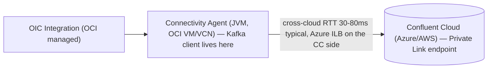

# Oracle Integration Cloud (OIC) → Confluent Cloud Kafka Integration

## Summary

Oracle Integration Cloud (OIC) is a managed iPaaS that ships a first-party Kafka adapter
used by FSI customers to publish from OCI-hosted business processes into Confluent Cloud
(commonly hosted on Azure or AWS, not OCI). The integration runs through OIC's Connectivity
Agent — a JVM hop in OCI that proxies producer traffic across the cross-cloud interconnect
to the CC cluster. The architecture introduces three Kafka-specific gotchas not present in
self-managed producer deployments: (1) the OIC adapter constrains compression to GZIP and
silently rejects others (notably zstd), (2) the "Additional Properties" passthrough table in
the OIC Connection UI does **not** guarantee that every Kafka producer property reaches the
underlying client — some are honored, some overridden, some ignored, and Oracle does not
publish the matrix, and (3) cross-cloud RTT (OCI→Azure typically 30–80ms via the dedicated
interconnect) interacts badly with the default `request.timeout.ms=30000` and with Azure's
4-minute Internal Load Balancer silent-kill on idle TCP flows. The canonical FSI baseline
(`acks=all`, `enable.idempotence=true`, RF=3, `min.insync.replicas=2`) still applies but
the configuration table needs cross-cloud overrides on top.

## Detail

### Architecture

The Kafka producer client lives in the Connectivity Agent JVM, not in the OIC integration
runtime. This matters because:

- Producer JMX, log levels, and JVM flags must be set on the Agent, not on OIC.
- The Agent is the TCP endpoint the Azure ILB sees — so the [Azure Connection Management](azure-connection-management.md)
  silent-kill problem applies to the Agent's outbound socket lifecycle.
- The OIC adapter sits **above** the Kafka client and brokers property assignment via a
  UI-driven properties table whose passthrough semantics are not fully published.

### Compression constraint — GZIP only

The OIC Kafka adapter is documented to accept **GZIP** as its compression algorithm.
Setting `compression.type=zstd` (Confluent's storage-optimized canon default for
non-latency-tier workloads) or `compression.type=lz4` (the throughput canon default)
causes the adapter to fail to publish — observed as connection-establishment failures
rather than per-record errors, which makes the misconfiguration look like a network or
auth issue.

> ⚠️ unverified — the GZIP-only constraint is documented in customer-facing FSI runbooks
> and the 2026-04-29 /review report (claim oic-14) but is not surfaced in the public
> Oracle docs nor in `confluent-docs` (Oracle product). The behavioral assertion
> (zstd "breaks the connection" rather than failing per record) is operationally
> reported and should be re-confirmed before authoring customer-facing guidance.

Operational guidance: **do not set `compression.type` in the OIC Additional Properties
table**. Let the adapter pick GZIP. On the topic side, set `compression.type=producer`
(canon-compliant) so the broker stores the GZIP-compressed batch without recompression.
This is a justified deviation from the LZ4/zstd canon defaults — see
[FSI Producer Configuration](../patterns/producer-config-fsi.md) for the canon and
[Producer Batching Configuration](producer-batching-config.md) for the compression
trade-offs.

### Property passthrough — what OIC actually honors

OIC's Connection UI exposes an "Additional Properties" key/value table that the docs
describe as pass-through to the underlying Kafka producer. In practice the passthrough is
partial:

- Some properties are honored as written (typically the standard `*.timeout.ms`,
  `*.backoff.ms`, and `linger.ms` / `batch.size` family).
- Some are **overridden** by the adapter (compression, security settings, and any
  property the adapter owns operationally).
- Some are **silently ignored** (no error, no log entry) — most dangerously, properties
  the adapter doesn't recognize because of a version mismatch between the embedded
  Kafka client and the customer's expected canon (e.g., recent KIP-introduced settings).

> ⚠️ unverified — Oracle does not publish the full honored/overridden/ignored matrix
> for the OIC Kafka adapter, and the matrix appears to vary across OIC releases.
> Treat the table as advisory and validate every property end-to-end via
> producer JMX metrics on the Connectivity Agent before relying on it for SLA-tier
> traffic. This was flagged as the highest-severity premise in the 2026-04-29 /review
> (Premise Challenge #2, Critical).

### Cross-cloud RTT and the timeout chain

OCI→Azure RTT via the dedicated interconnect is typically 30–80ms one-way (region pair
dependent), versus the same-region 1–3ms that Confluent's default producer timeouts assume.
Three timeouts compose into the delivery deadline:

- `request.timeout.ms` (default `30000`) — per-attempt wait for broker ack.
- `linger.ms` (default `0`, FSI recommendation `50`) — batch dwell time.
- `delivery.timeout.ms` (default `120000`) — overall deadline including retries.

The Kafka constraint is `delivery.timeout.ms >= linger.ms + request.timeout.ms` (per
[Apache Kafka producer configs](https://kafka.apache.org/41/configuration/producer-configs/),
validated against the [Producer Batching Configuration](producer-batching-config.md)
wiki). The mistaken "2× request.timeout.ms" rule sometimes seen in OIC tuning docs is
incorrect — the value 120,000 happens to be the Kafka default and is fine, but the rule
that produced it is wrong.

Recommended cross-cloud overrides on top of the FSI producer baseline (see
[producer-config-fsi](../patterns/producer-config-fsi.md)):

| Property | OIC cross-cloud value | Rationale |
|----------|----------------------|-----------|
| `request.timeout.ms` | `60000` | Absorbs OCI→Azure interconnect RTT plus broker ISR ack latency |
| `delivery.timeout.ms` | `120000` | Kafka default; satisfies `≥ linger.ms + request.timeout.ms` |
| `retry.backoff.ms` | `1000` | Prevents hammering during ISR shrinks; default 100ms is too aggressive cross-cloud |
| `linger.ms` | `50` | Batches small FSI messages on a high-latency link |
| `batch.size` | `65536` | 64KB ceiling; works with linger.ms=50 for cross-cloud batching |
| `max.block.ms` | `60000` | Prevents OIC integration thread hanging when buffer is full |
| `connections.max.idle.ms` | `180000` | 3 min, under Azure ILB's 4-min silent-kill — see [Azure Connection Management](azure-connection-management.md) |

`acks=all`, `enable.idempotence=true`, `max.in.flight.requests.per.connection=5` remain
canon and are non-negotiable for FSI integrity.

### Idle-connection silent-kill on the Azure side

The CC cluster is fronted by an Azure ILB (Enterprise tier on Azure) or an AWS NLB
(Enterprise on AWS). When the cluster is on Azure, the [Azure Connection Management](azure-connection-management.md)
silent-kill problem applies to the Connectivity Agent's producer socket: an idle 4-minute
gap drops the flow with no RST and no log entry, and the next produce fails with
`TimeoutException`. The OIC integration pattern is particularly exposed because the
Agent's producer can sit idle between OIC integration invocations.

Mitigations, in order of preference:

1. **PrivateLink architectural bypass** — if the CC cluster is reachable via Confluent
   Cloud PrivateLink Gateway from the OCI VCN, the ILB hop is removed entirely. See
   [Private Networking](private-networking.md).
2. **`connections.max.idle.ms=180000`** in the OIC Additional Properties table — closes
   the client-side socket before the ILB does, forcing a clean reconnect on next use.
3. **librdkafka users only:** `socket.keepalive.enable=true` to send TCP keepalives
   before the ILB idle window expires. The Java producer (which OIC's adapter uses)
   does not expose this directly.

### CC cluster-side settings

Cluster and topic settings are independent of OIC and follow standard FSI canon:

- `replication.factor=3` on production topics.
- `min.insync.replicas=2` (RF − 1).
- `compression.type=producer` on the topic (no broker recompression of GZIP batches).
- No partition should sustain more than ~5–10 MB/s — see [CC Cluster Tiers](cc-cluster-tiers.md)
  for tier capacity limits.
- **Basic/Standard CC clusters throttle bursty OIC traffic**; Dedicated or Enterprise
  is the production FSI default for OIC integrations.

### Triage tree for `acks=all` timeouts

When OIC reports timeout failures publishing to CC, the failure surface is in three
independent layers — failure to triage all three is the single most common cause of
prolonged outages on this pattern:

1. **Producer layer (on the Connectivity Agent)** — collect `record-error-rate`,
   `record-retry-rate`, `request-latency-avg`, `connection-close-rate` JMX metrics
   from the Agent JVM. The producer exception class is the most valuable single
   triage signal.
2. **Cluster layer (CC)** — check ISR shrink events, partition leader skew, and
   per-partition throughput against the tier limits.
3. **Network layer (OCI↔Azure)** — measure RTT via iperf3 or ping from the Agent VM
   to the CC PrivateLink endpoint; check TCP retransmit rate (sustained >0.5% is a
   network problem, not a Kafka problem).

Topic-level alerts (zero msgs in 5 min, 70% drop-off) do **not** detect `acks=all`
timeout failures because idempotent retries usually succeed on the next attempt and
mask the failure as latency rather than data loss. The producer is the only authoritative
source for delivery success — alerting must include producer JMX, not just topic
volume.

### EOS implications

The OIC adapter's exposure of `transactional.id` is not documented. For FSI use cases
that require transactional EOS across multi-record publishes (saga commits,
multi-account journal entries — see [FSI Exactly-Once Pattern](../patterns/fsi-exactly-once.md)),
validate end-to-end before relying on transactional semantics from OIC:

- Shared or regenerated `transactional.id` across Agent restarts causes
  `ProducerFenced` exceptions — confirmed via [exactly-once-semantics](exactly-once-semantics.md).
- If OIC's adapter regenerates the transactional ID on each Agent JVM restart,
  transactional EOS is effectively unavailable for this integration. Confirm with
  the Oracle/OIC team before committing to this pattern for transactional
  workloads.

> ⚠️ unverified — OIC Kafka adapter support for transactional producers
> (`transactional.id`, `initTransactions`, `beginTransaction`/`commitTransaction`)
> is not surfaced in the 2026-04-29 /review report or in `confluent-docs`. Treat
> as unsupported for transactional EOS planning unless the OIC team confirms
> otherwise in writing.

## Related

- [Producer Batching Configuration](producer-batching-config.md) — RecordAccumulator,
  `linger.ms` / `batch.size` interaction, compression trade-offs (foundational)
- [Azure Connection Management for Kafka Clients](azure-connection-management.md) —
  ILB 4-minute silent-kill and the three client properties that defeat it
- [FSI Producer Configuration](../patterns/producer-config-fsi.md) — canon producer
  baseline that OIC's overrides extend
- [FSI Exactly-Once Pattern](../patterns/fsi-exactly-once.md) — five-layer EOS
  for financial services
- [Confluent Cloud Cluster Tiers](cc-cluster-tiers.md) — per-tier capacity limits
  that bound OIC throughput
- [Exactly-Once Semantics](exactly-once-semantics.md) — idempotence and
  transactional producer mechanics
- [Private Networking](private-networking.md) — PrivateLink as the architectural
  bypass for the ILB hop
