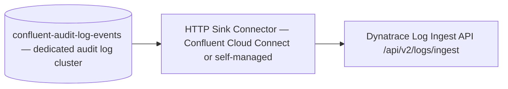

# Audit Log SIEM Integration

## Summary

Confluent Cloud audit logs capture security and administrative events — authentication failures, RBAC denials, topic lifecycle changes, API key operations, and Confluent staff access — on the `confluent-audit-log-events` topic. These events are not available through the Metrics API. Forwarding them to a SIEM or observability platform (Dynatrace, Splunk, Datadog, Elastic) requires a Kafka Connect sink pipeline. For FSI environments, this pipeline is the enforcement point for proving authentication controls, change management, and vendor access controls are working.

## Pattern

### Two Data Planes

Confluent Cloud exposes monitoring data through two independent channels:

| Channel | What It Contains | Access Method | Dynatrace Integration |
|---------|-----------------|---------------|----------------------|
| **Metrics API** | Operational metrics: throughput, consumer lag, partition counts, connector health, Flink stats | HTTPS pull (`/v2/metrics/cloud/export`) | Native Dynatrace CC extension — direct pull, no topic pipeline needed |
| **Audit Log** | Security events: auth failures, RBAC denials, config changes, API key lifecycle, access transparency | Kafka topic (`confluent-audit-log-events`) on dedicated audit log cluster | No native integration — requires Kafka Connect sink to Dynatrace Log Ingest API |

The Metrics API handles health and performance. The audit log handles security, compliance, and change control. Replacing Splunk with Dynatrace requires addressing both channels independently.

### Audit Log Event Types

| Alert Category | Event Type (`type` field) | Filter | FSI Relevance |
|---|---|---|---|
| Auth failures | `io.confluent.kafka.server/authentication` | `outcome: DENY` | Brute force, expired keys, misconfigured clients |
| RBAC/ACL denials | `io.confluent.kafka.server/authorization` | `authorizationInfo.granted: false` | Privilege escalation attempts, misconfigured service accounts |
| Topic create/delete | `io.confluent.kafka.server/request` | `methodName: kafka.CreateTopics`, `kafka.DeleteTopics` | Unauthorized topology changes, accidental deletes |
| ACL modifications | `io.confluent.kafka.server/request` | `methodName: kafka.CreateAcls`, `kafka.DeleteAcls` | Permission changes outside change control |
| Config changes | `io.confluent.kafka.server/request` | `methodName: kafka.AlterConfigs` | Retention, replication factor, or security config drift |
| Schema Registry auth | `io.confluent.sg.server/authentication` | `outcome: DENY` | Unauthorized schema access |
| Schema Registry ops | `io.confluent.sg.server/request` | Schema create/update/delete methods | Schema evolution outside governance process |
| Flink auth failures | `io.confluent.flink.server/authentication` | `outcome: DENY` | Unauthorized Flink SQL access |
| Flink RBAC denials | `io.confluent.flink.server/authorization` | `authorizationInfo.granted: false` | Statement execution denied |
| API key lifecycle | `io.confluent.cloud/request` | API key create/delete/rotate methods | Key management outside policy |
| Cluster/env changes | `io.confluent.cloud/request` | Cluster create/delete/update methods | Infrastructure changes outside IaC |
| RBAC role bindings | RBAC event methods | `CreateRoleBinding`, `DeleteRoleBindingById` | Privilege grants/revocations |
| IP filter violations | `io.confluent.cloud/authorization` | IP filtering denials | Access from unauthorized networks |
| Confluent staff access | `io.confluent.cloud/access-transparency` | Any event | Confluent personnel touching customer resources — regulators ask about this |

### Audit Log Record Structure

Each record follows CloudEvents format with these filterable fields:

| Field | Description |
|-------|-------------|
| `type` | Event category (e.g., `io.confluent.kafka.server/authentication`) |
| `source` | CRN of the resource where the event originated |
| `subject` | CRN of the affected resource |
| `time` | ISO 8601 timestamp |
| `data.serviceName` | Service (kafka, schema-registry, ksqldb, flink) |
| `data.methodName` | Specific operation (`kafka.CreateTopics`, `kafka.Authentication`, etc.) |
| `data.resourceName` | CRN of target resource |
| `data.authenticationInfo` | Principal details (user/service account) |
| `data.authorizationInfo` | Access control outcome: `granted`, `operation`, `resourceType`, `patternType` |

### Sink Pipeline Architecture



**Recommended: two connector instances** for separation of concern and SLA:

| Instance | Events | Batching | Alert SLA |
|----------|--------|----------|-----------|
| Security (high-priority) | Auth failures, RBAC denials, access transparency | Immediate (low `batch.size`) | SOC real-time feed |
| Operational audit (lower-priority) | Topic creates, config changes, schema ops, API key lifecycle | Batched (higher `batch.size`, `linger.ms`) | Change audit trail |

### Connector Configuration

Use the HTTP Sink Connector pointed at Dynatrace's Log Ingest API. No native Dynatrace sink connector exists on Confluent Hub.

```properties
# Connector basics
connector.class=io.confluent.connect.http.HttpSinkConnector
topics=confluent-audit-log-events
tasks.max=1

# Dynatrace Log Ingest endpoint
http.api.url=https://{your-env}.live.dynatrace.com/api/v2/logs/ingest
headers=Authorization:Api-Token {your-dt-api-token},Content-Type:application/json

# Batching — tune per instance (security vs operational)
batch.max.size=1
# For operational audit instance, increase to 100+

# SMT: filter for security events only (security instance)
transforms=filterType
transforms.filterType.type=org.apache.kafka.connect.transforms.Filter
transforms.filterType.condition=${topic == 'confluent-audit-log-events'}
```

**Note:** The SMT filter syntax above is simplified. In practice, use a Record Filter or custom predicate to filter on the `type` field within the event payload. Alternatively, use ksqlDB or Flink SQL to pre-filter the audit log topic into separate security and operational topics, then point each connector instance at its filtered topic.

### Key Constraints

- **7-day retention** on `confluent-audit-log-events`. The sink pipeline must keep up or events are lost.
- **Dedicated audit log cluster** requires separate API credentials. An OrganizationAdmin must create them.
- **5-minute metric offset** on the Dynatrace CC extension for operational metrics (not audit logs). Audit log events have their own latency profile based on sink connector throughput and batching.
- **Auth failures are only logged** when the connection attempts to use one of your resources — failed connections that never reach a resource are not captured.

## When to Use

- Migrating from Splunk to Dynatrace (or any SIEM swap) and need to preserve security event alerting
- Standing up SOC monitoring for Confluent Cloud in a regulated environment
- Compliance requires audit trail for authentication, authorization, and infrastructure changes
- Need to alert on Confluent staff access to customer environments (access-transparency events)
- Any FSI engagement where authentication and change control audit is a regulatory requirement

## Caveats

- The Dynatrace CC extension covers operational metrics only — it will never surface auth failures, RBAC denials, or config changes. These are audit log events and require the sink pipeline described here.
- No native Dynatrace sink connector exists. The HTTP Sink Connector works but requires manual payload shaping to match Dynatrace's expected log format.
- Access-transparency events are unique to Confluent Cloud — no equivalent exists in CP or CFK. Forward all of them unfiltered; compliance teams need them at audit time.
- The SMT filter approach has limitations for complex predicates on nested JSON fields. Pre-filtering via ksqlDB or Flink SQL into dedicated topics is more robust for production deployments.
- Audit log volume scales with cluster activity. High-throughput clusters with many service accounts can generate significant event volume — monitor the sink connector's consumer lag.

## Related

- [FSI Data Streaming Platform](concepts/fsi-data-streaming-platform.md) — observability templates for six providers including Dynatrace and Splunk (operational metrics only)
- [FSI Compliance](concepts/fsi-compliance.md) — CI/CD audit trail mapping to regulatory frameworks
- [Consumer Lag Monitoring](concepts/consumer-lag-monitoring.md) — operational metrics monitoring (the other half of the observability story)
- [FSI Exactly-Once Pattern](patterns/fsi-exactly-once.md) — audit logging requirements for transactional processing
