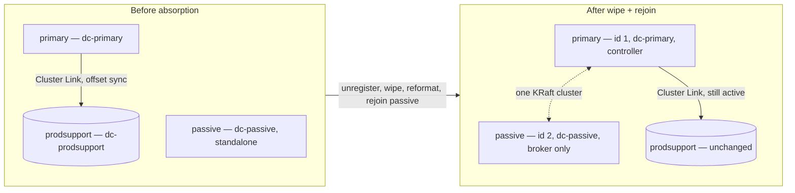

# CP → MRC Live Migration Rehearsal Rig

## Summary

A disposable local rig that rehearses a specific, higher-risk Confluent
Platform migration: absorbing a standalone Passive Region cluster's live
brokers into a Primary (Active) cluster's KRaft quorum to form a
Multi-Region Cluster (MRC), while a Cluster Linking bridge into a smaller
"Prod Support" environment stands in as a temporary DR safety net for the
absorption window — layered on top of an **existing** Confluent Replicator
DR pipe (Active → Passive) that the migration is in the process of retiring.
Two independently runnable tracks reach the same verified end state —
Docker Compose (fast, prebuilt images) and real cp-ansible (package
installs + systemd, closer to the actual production tooling) — and both
were executed end-to-end, not just written. The cp-ansible track's full
topology now includes Schema Registry and Kafka Connect (generic worker on
Active/Prod Support, Confluent Replicator executable on Passive) alongside
brokers/controllers, plus a continuous ShadowTraffic producer against
Active standing in for live traffic. The 5-stage cutover sequence (build
bridge → cutover gate → stop Replicator → MRC absorption → sever bridge)
is orchestrated via a `Workflow` script (`ansible/stages/workflow.mjs`)
rather than run by hand. Key trade-off: this validates *procedure* (command
order, what breaks, what recovers) on toy single-broker clusters over a
loopback network, not capacity, real WAN behavior, or multi-controller
quorum safety.

## Pattern

### Why this rehearsal exists

The live-absorption approach carries a specific, real risk: the moment a
Passive Region broker is unregistered from its own cluster and reformatted
to join Primary's quorum, the old Passive Region cluster stops being an
independent failover target — and partition reassignment into the final
MRC layout is not instantaneous, so there is a real window with reduced or
zero DR coverage for whichever topics haven't finished reassigning yet.
Standing up a Cluster Linking bridge to an already-approved "Prod Support"
environment *before* starting the absorption gives you an independent,
continuously-mirrored safety net that exists outside the KRaft quorum
being reshaped — at the cost of needing that bridge validated (mirror lag
≈ 0) before the first broker gets touched. This rig proves the mechanics
of that bridge actually hold up if Primary fails mid-migration.

### Topology (both tracks)



### Procedure — Track 1: Docker Compose (fastest)

1. **Stand up three single-broker clusters** with `confluentinc/cp-server:latest`
   — `primary` (rack `dc-primary`), `passive` (rack `dc-passive`), `prodsupport`
   (rack `dc-prodsupport`) — combined KRaft mode (broker + controller in one
   process; fine for local experimentation only, not a production pattern).
2. **Seed `primary`** with a demo topic and a few messages, standing in for
   live production traffic.
3. **Create the Cluster Link `primary → prodsupport`**
   (`kafka-cluster-links --create`, `bootstrap.servers=<primary>`,
   `consumer.offset.sync.enable=true`). Leave `acl.sync.enable` off — it
   requires `authorizer.class.name` configured on the destination, which
   this lightweight rig doesn't set up. ACL/RBAC portability for the real
   migration is handled separately by the `kafka-admin` tool — see
   [Kafka-Admin — Topic and RBAC Migration Tooling](kafka-admin-topic-rbac-tool.md).
4. **Create the mirror topic** and confirm mirror lag is ≈ 0 via
   `kafka-replica-status --include-mirror` (`LastCaughtUpLagMs: 0` on every
   partition) — this is the hard gate before step 5.
5. **The destructive step**: stop `passive`, remove its container (no
   volume attached, so its data is genuinely gone — this stands in for
   `kafka-cluster unregister` + `kafka-storage format --cluster-id
   <primary> --no-initial-controllers`), then bring it back up from a
   **separate, complete** compose file that configures it as a
   **broker-only** new node joining Primary's cluster ID and controller
   quorum, keeping its real rack label (`dc-passive`).
   - Gotcha: even a broker-only KRaft node needs
     `controller.listener.names` set and `CONTROLLER` present in
     `listener.security.protocol.map`, even though it never listens on
     that port itself — omitting either fails at storage-format time.
6. **Verify the merge**: `kafka-broker-api-versions` from `primary` now
   lists both brokers (id 1 rack dc-primary, id 2 rack dc-passive) as one
   cluster.
7. **Verify replica placement**: create a topic with an explicit
   `--replica-placement` JSON constraining one replica to each rack;
   confirm `Replicas: 1,2` in `kafka-topics --describe`.
8. **Rehearse the actual failure scenario** — the one that matters: stop
   `primary`, run `kafka-mirrors --promote` on the Prod Support mirror,
   confirm it reaches `STOPPED` (promoted), produce a new message, consume
   everything back from Prod Support with Primary fully down.

### Procedure — Track 2: real cp-ansible (package install + systemd)

Broadly the same shape, but installed for real via `confluent.platform.all`
onto disposable "bare metal" hosts, since cp-ansible manages OS packages and
systemd services rather than running a prebuilt image. No Vagrant/VirtualBox
needed — `geerlingguy/docker-rockylinux9-ansible` containers give real
systemd under Docker (`privileged`, `cgroup: host`); Ansible reaches them
via the `community.docker.docker` connection plugin (`docker exec`), not
SSH, since that image ships no sshd.

This track's topology is deliberately closer to the real client scenario
than Track 1: three environments (`cp-primary-host` = Active, `cp-passive-host`
= Passive, `cp-prodsupport-host` = Prod Support), each running broker +
KRaft controller + Schema Registry + Kafka Connect, **plus** Confluent
Replicator deployed as a Connect executable on `cp-passive-host` mirroring
`payments.transaction.completed` from Active — the *existing* DR pipe the
migration is retiring, not something this rig invents. A ShadowTraffic
container (`shadowtraffic/shadowtraffic`, config at `ansible/shadowtraffic/config.json`)
produces continuous low-volume synthetic transactions to Active so the
rehearsal has live background traffic during cutover, not just manually
produced markers.

Inventory structure: `kafka_controller` and `kafka_broker` groups both
point at the same single host per cluster (isolated-mode, colocated
services — a supported cp-ansible pattern, unlike Kafka's single-process
combined mode Track 1 has to use). The rejoin step uses an **expanded**
inventory (`ansible/inventories/primary-expanded.yml`) where
`kafka_controller` still lists only the Primary host, but `kafka_broker`
now lists **both** Primary and the wiped Passive host — this is
cp-ansible's documented "scale up" workflow (add a host to an inventory
group, re-run the playbook), applied to a host that used to belong to a
*different* cluster rather than a brand-new empty one.

#### Command reference — full rebuild from scratch

The rig is fully disposable; this is the exact sequence to bring it back
from nothing (e.g. after a `99-teardown.sh` or a Docker Desktop restart):

```bash
cd ansible
./scripts/00-up-hosts.sh          # docker compose up the 3 hosts, install python3.11+pip+sudo, pip install packaging/PyYAML
./run.sh ansible -i ansible/inventories/test-connectivity.yml all -m ping   # sanity check — note: run.sh cd's up one dir, so inventory paths are ansible/inventories/... from here
for inv in primary passive prodsupport; do
  ./run.sh ansible-playbook -i "ansible/inventories/${inv}.yml" confluent.platform.all
done
./scripts/02-seed-and-link.sh      # create + seed the topic on Active, create the Active -> Prod Support Cluster Link
```

Then start the ShadowTraffic producer (not wrapped in a script — run
manually, on the same Docker network the ansible hosts share,
`<compose-project>_cpans`, e.g. `cp-migration-demo-hosts_cpans`):

```bash
docker run -d --name shadowtraffic-active-producer \
  --network cp-migration-demo-hosts_cpans \
  -v "$(pwd)/ansible/shadowtraffic/config.json:/home/config.json" \
  shadowtraffic/shadowtraffic:latest --config /home/config.json
```

ShadowTraffic requires license env vars (`LICENSE_ID`, `LICENSE_EMAIL`,
`LICENSE_ORGANIZATION`, `LICENSE_EDITION`, `LICENSE_EXPIRATION`,
`LICENSE_SIGNATURE`) even at this low a volume — the container exits
immediately without them. Pass them via `--env-file license.env` (gitignored,
per-project — do not reuse a license file from a different client
engagement/repo). See
[ShadowTraffic — Confluent Cloud Datagen](shadowtraffic-confluent-cloud-datagen.md)
for the full flag reference.

From here, run the 5-stage cutover via the `Workflow` tool against
`ansible/stages/workflow.mjs` (Build Bridge → Cutover Gate → Stop Replicator
→ MRC Absorption → Sever and Clear) rather than the individual
`ansible/stages/0N-*.sh` scripts by hand — the script encodes the same
commands plus the gate logic (Stage 2 refuses to let Stage 3 stop Replicator
until a marker message is proven to land on **both** Prod Support and
Passive) and preflight checks (kill stray `ansible-playbook` processes
before every stage).

Environment gotchas hit and fixed, in order encountered — useful to know
up front so you don't rediscover them one at a time:

1. **Non-blocking stdio breaks ansible-core.** If your shell's stdio fds
   come in non-blocking, ansible-core refuses to run at all
   (`Ansible requires blocking IO on stdin/stdout/stderr`). Fix: clear
   `O_NONBLOCK` on fds 0/1/2 via a small Python snippet, then `exec` the
   real ansible command from the same process so the fix carries over.
   This is an artifact of the harness/shell used, not a Confluent or
   cp-ansible issue.
2. **`ansible.cfg` not picked up.** Export `ANSIBLE_CONFIG` explicitly
   rather than relying on cwd — cp-ansible requires `hash_behaviour =
   merge` in `[defaults]`, and its `Confirm Hash Merging Enabled` assertion
   task fails hard otherwise.
3. **Target Python too old.** cp-ansible asserts `ansible_python_version
   >= 3.10` on the target; Rocky Linux 9's default `python3` is 3.9.
   Install `python3.11` (+ `pip`) on every target and set
   `ansible_python_interpreter` in the inventory.
4. **Missing `packaging` / `PyYAML` on target.** cp-ansible's `common`
   role needs both importable on the target's Python interpreter — install
   them via `pip` on that same interpreter before the first run.
5. **`*_custom_properties` does not merge across levels.** cp-ansible's
   own docs warn that a variable like `kafka_broker_custom_properties`
   defined at more than one level (`all`, group, host) does **not** merge
   — only the most specific definition takes effect, silently dropping
   anything set at a broader level. Since each broker here needs a
   different `broker.rack` but the same single-node RF overrides, define
   the *entire* dict once, at host level, for every host — never split
   rack and RF overrides across two levels.
6. **Sequencing during the wipe**: stop the broker before its controller
   is gone, not after — killing the controller first left a broker stuck
   in `deactivating` waiting for a controller that would never come back,
   requiring a hard kill.
7. **Docker Desktop's VM memory is ONE shared pool across every container.**
   `cp-primary-host`, `cp-passive-host`, `cp-prodsupport-host`, and
   `shadowtraffic-active-producer` all run inside the same single Linux VM
   Docker Desktop manages — confirmed via `docker exec <host> free -h`
   reporting identical total/swap figures on all three hosts, and `docker
   info --format '{{.MemTotal}}'` reporting one VM-wide total, not a
   per-container limit. At the default Docker Desktop allocation (7.75GiB),
   running 3 environments × (broker + controller + Schema Registry + Kafka
   Connect) plus Confluent Replicator's much heavier executable (see next
   point) OOM-killed processes repeatedly and unpredictably depending on
   what else was mid-startup at the same moment. Bumping Docker Desktop to
   ~23GiB eliminated the OOM class of failure outright, without needing any
   of the heap-trim workarounds below. If you don't want to raise the VM
   allocation, every `*_service_environment_overrides.KAFKA_HEAP_OPTS` in
   the inventories is already trimmed well below CP's production defaults
   for exactly this reason (controller `-Xmx512M`, broker `-Xmx768M`,
   Schema Registry `-Xmx320M`, Connect/Replicator `-Xmx768M`–`-Xmx2560M`).
8. **Kafka Connect's plugin-scan is the actual OOM trigger, not steady-state
   load.** Both generic Kafka Connect and the Confluent Replicator
   executable OOM'd specifically during their one-time startup
   `ServiceLoaderScanner`/classgraph plugin scan — Replicator's classpath
   is far heavier (Cloud switchover schemas, `google-cloud-core`, `msal4j`,
   full Jetty/Netty, even a foreign-arch native Netty jar getting scanned)
   and needed up to `-Xmx2560M` to survive it even with zero other load on
   the VM. `-XX:ActiveProcessorCount=2` caps the scanner's thread-pool size
   (it defaults to `Runtime.availableProcessors()` — 14 on this Docker
   Desktop VM, meaning 14 concurrent scanner threads each buffering class
   metadata), which reduces the peak heap need considerably for a given
   `-Xmx`.
9. **A Connect/Replicator connector that fails at startup does not
   self-heal, even after the underlying problem is fixed.** If
   `kafka_connect_replicator_white_list` (or any source connector's topic
   list) names a topic that doesn't exist yet on the source cluster at the
   moment the connector starts, it fails permanently with
   `InvalidConfigurationException: topic.whitelist contains topics: [...]
   but these are either not present in the source cluster or are missing
   DESCRIBE ACLs` — this can happen simply because playbook ordering ran
   the destination cluster's install before the source topic was created.
   The systemd service itself stays `active` (the JVM/Connect runtime is
   up), masking the failure — check the connector's own state via its
   embedded REST API: `docker exec <host> curl -s
   localhost:8083/connectors/<name>/status`. Fix: create the topic, then
   `curl -X POST localhost:8083/connectors/<name>/restart` — the service
   does not need to be restarted, just the connector.

## When to Use

- Rehearsing a **live broker absorption into an existing quorum** (as
  opposed to a greenfield build) before touching real infrastructure —
  particularly when hardware constraints rule out provisioning new
  capacity for the target MRC, forcing reuse of the source cluster's own
  hosts.
- Validating that a **Cluster Linking DR bridge** genuinely survives the
  primary cluster going down mid-migration, before committing to it as the
  sole safety net during a risky transition window.
- Rehearsing the **cp-ansible side specifically** — inventory structure
  for a multi-cluster-to-one-cluster consolidation, and the "scale up"
  workflow applied to a host moving between clusters rather than a
  brand-new one.

## Caveats

- **Track 1 (Docker Compose) still has no Schema Registry, no Kafka
  Connect** — only Kafka brokers + KRaft controllers. Track 2 (cp-ansible)
  now includes both, so use Track 2 if the thing you need to rehearse
  involves SR/Connect specifically.
- **No stretched Kafka Connect worker pool across DCs is rehearsed or
  recommended here** — each environment runs its own independent Connect
  worker pool (Active's, Prod Support's) plus the separate Replicator
  executable on Passive; none share a `group.id`/internal-topics across
  hosts. Checked against `confluent-docs`: Confluent for Kubernetes (CFK)
  documents a supported stretched-Connect-group pattern for K8s deployments
  (`co-multi-region.html` — matching `group.id` +
  `config.storage.topic`/`offset.storage.topic`/`status.storage.topic`
  across regional Connect CRs, plus `enableExternalInterInstance: true` to
  route inter-worker rebalance traffic through external listeners across
  clusters). The base (non-K8s) multi-region docs have **no equivalent
  section** for standard/VM Confluent Platform — the same underlying
  mechanism (same `group.id` + same internal topic names + network
  reachability between workers) is technically achievable via cp-ansible's
  `kafka_connect_custom_properties`, but it is not an officially documented
  or supported pattern outside CFK. Recommend the single-region worker
  pool + cold-start DR pattern for standard CP deployments instead, and
  reserve a literal stretched Connect group for CFK/Kubernetes estates.
  Kafka Connect's internal topics
  (`connect-configs`/`connect-offsets`/`connect-status`) still get no
  default MRC replica-placement constraint and need one applied manually
  regardless of which pattern is used.
- **No real WAN latency or bandwidth contention** — everything runs over
  loopback or a Docker bridge network. The real question of whether a
  cluster link keeps up while reassignment traffic competes for the same
  inter-DC bandwidth cannot be answered by this rig.
- **No real multi-controller quorum.** Both tracks run a single KRaft
  controller (on Primary) throughout. If any real Passive Region host also
  carries the controller role — relevant to a 2:2:1 quorum + tiebreaker
  design — adding or removing it from a *live* quorum is a materially
  different and more dangerous operation than anything rehearsed here:
  quorum majority must never drop below majority mid-swap, or the metadata
  log is lost outright, not merely DR coverage. Confirm which real hosts
  carry the controller role before assuming this rig's broker-only rejoin
  procedure covers them.
- **Toy scale.** One broker per cluster, a handful of messages. Reassignment
  throttling, disk I/O contention, and partition-count effects at real
  data volumes are not represented.
- **Confidence is `medium`, not `high`**, because much of this article is
  rig-specific procedure and one session's observed environment quirks
  (Docker/ansible-core/geerlingguy-image behavior) rather than claims
  documented by Confluent — that category isn't MCP-checkable, the same
  reasoning applied to the internals of the `kafka-admin` tool in
  [Kafka-Admin — Topic and RBAC Migration Tooling](kafka-admin-topic-rbac-tool.md).
  The genuinely Confluent-specific claims embedded in the procedure — KRaft
  broker unregister/reformat mechanics, Cluster Linking migration steps and
  ACL-sync/authorizer requirement, cp-ansible's Python version matrix and
  `*_custom_properties` merge behavior, replica-placement JSON schema — were
  checked against `confluent-docs` while this rig was built and confirmed
  accurate as of Confluent Platform 8.3.

## Related

- [DR — Multi-Region Cluster](dr-multi-region-cluster.md) — the target
  architecture this rehearsal is migrating toward.
- [x86 → LinuxONE Cluster Linking Migration](x86-to-linuxone-cluster-linking-migration.md)
  — the audit → validate → cutover → evidence-collection runbook shape this
  migration's Cluster Linking cutover follows.
- [Kafka-Admin — Topic and RBAC Migration Tooling](kafka-admin-topic-rbac-tool.md)
  — the tool that handles topic/RBAC provisioning and the ACL/RBAC
  portability this rig deliberately skips.
- [SLA Tiers](../concepts/sla-tiers.md) — informs how aggressively to
  pursue a zero-DR-coverage-window mitigation like this one.
