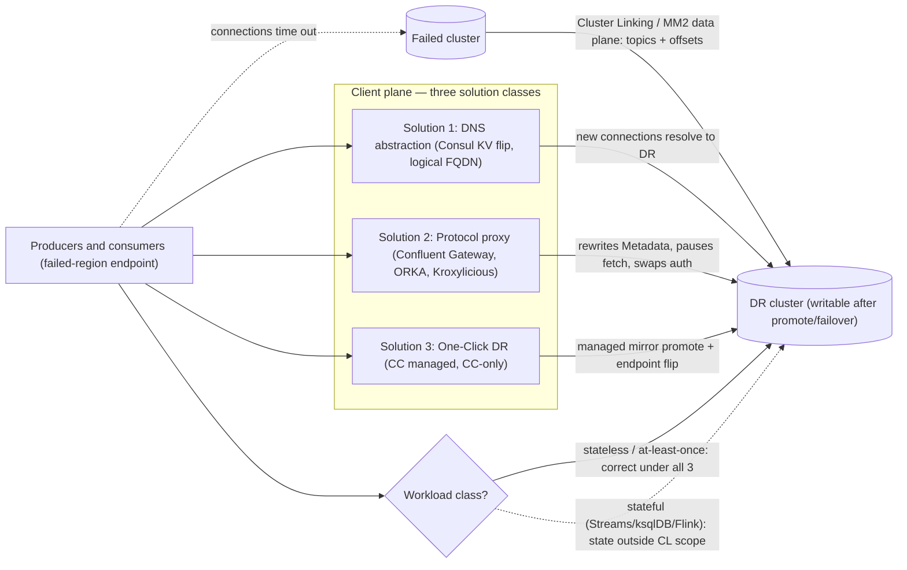

# DR Application Routing — Pointing Clients at the Surviving Cluster

## Summary

Kafka DR patterns ([Cluster Linking](dr-cluster-linking.md), [MM2](dr-mirrormaker2.md), [MRC](dr-multi-region-cluster.md)) handle the **data plane** — replicating topics, offsets, and (in MRC's case) committing synchronously across regions. They do **not** solve the **client plane**: how do the producers and consumers on the failed region's endpoint find the surviving cluster? Three solution classes exist — **DNS abstraction** (Consul / managed DNS, requires a TTL-bounded reconnect), **protocol proxy** (Confluent Gateway, Kroxylicious, ORKA — keeps existing client connections by re-routing inside the Kafka wire protocol), and **cloud-native control plane** (Confluent's One-Click DR migration for managed CC deployments). They differ on RTO, whether clients restart, and — critically — what they preserve for stateful applications. The discriminator that determines which is viable is **workload class**: stateless consumers tolerate all three; **stateful apps (Kafka Streams, ksqlDB, Flink-with-state) are not generally guaranteed correct under any of them** because the state surface (changelogs, repartition topics, in-flight EOS transactions, RocksDB) is outside Cluster Linking's replication boundary.

## Pattern

### The problem the data plane doesn't solve

Cluster Linking and MM2 replicate **topic data** and **consumer offsets** to the DR cluster. A failover (`mirror failover`) makes the DR topics writable. At that moment, every existing producer and consumer is still connected to the failed cluster's bootstrap endpoint. Three things happen unless you intervene:

1. **Producers** retry against the failed bootstrap, hit `connections.max.idle.ms` or TCP-reset behavior, eventually time out per `delivery.timeout.ms` and surface errors to the application.
2. **Consumers** lose their fetch and heartbeat connections, eventually hit `session.timeout.ms`, leave the group, and the group becomes uncoordinated.
3. **Applications restart** is the conventional remediation — operations team pushes a config change (new bootstrap.servers) and bounces every pod. RTO is dominated by orchestrator rollout time and per-app reconnection.

The three solution classes below close the gap between "DR cluster is up and writable" and "clients are producing/consuming on the DR cluster again," with very different operational and correctness profiles.

### Solution 1 — DNS abstraction (Consul / managed DNS)

Clients are configured with a **logical hostname** (e.g., `kafka.fsifirm.com:9092`) that resolves via Consul or a similar service-discovery layer. On failover, an atomic KV flip (in Consul: `fsi/kafka/active-region = west`) updates the DNS record. This is the pattern documented in [DR — Cluster Linking](dr-cluster-linking.md) §3 and the `fsi-dsp` `fsi-dr.sh` script.

How clients pick up the change:

- New connections (any process started after the flip) resolve to the new endpoint immediately.
- Existing TCP connections do **not** redirect — they continue talking to the old IP until they time out or the application reconnects.
- Time-to-redirect for existing clients is bounded by:
  - DNS TTL (typically 60s for production Consul) **plus**
  - The client's reconnection logic (Kafka clients reconnect on `connections.max.idle.ms` expiry or on broker-side TCP reset).
- The `Metadata` response from the broker contains broker advertised hostnames. If those names refer to the failed cluster, the client will still try to reach the failed brokers on subsequent produce/fetch calls. Advertised listeners on both clusters must point at the logical FQDN, not at cluster-specific names, or the redirect breaks past the bootstrap call.

**RTO floor**: ~30–90 seconds end-to-end (10–30s Consul KV propagation + 30–60s client reconnection), assuming advertised listeners are correctly configured.

**Application restart**: Not required for the *client* in steady state, but applications with hard timeouts or non-retrying producers may surface errors to the business logic during the cutover window and require operator intervention.

### Solution 2 — Protocol proxy (Confluent Gateway, ORKA, Kroxylicious)

A Kafka-protocol-aware proxy sits in front of the cluster. Clients connect to the proxy address, not the broker. On failover, the proxy is re-pointed at the DR cluster; clients see a brief disconnect, reconnect to the same proxy address, and resume. See [Confluent Gateway](../concepts/confluent-cloud-gateway.md) for the canonical product description.

What "protocol-aware" enables that DNS abstraction cannot:

- The proxy parses `Metadata` responses and **rewrites** broker advertised hostnames to its own, so subsequent `Produce` and `Fetch` calls also land on the proxy. DNS-level redirect cannot do this — clients use the names in `Metadata`, not the bootstrap name, for follow-on traffic.
- The proxy can **pause** clients during the cutover window (e.g., return empty `FetchResponse` payloads so consumers idle without rebalancing). The Kroxylicious `FetchResponseFilter` extension point demonstrates this is a sound protocol mechanism — empty fetches are indistinguishable from a quiet topic, and the heartbeat path is decoupled from fetch so group membership is preserved.
- The proxy can **swap authentication** (e.g., client mTLS → broker SASL/OAUTHBEARER) so credentials don't need to be re-issued for the DR cluster.

**RTO floor**: seconds (~5–30s for connection re-establishment), assuming the proxy is already running and the route flip is operator-initiated against a synced DR cluster.

**Application restart**: Not required. This is the load-bearing benefit.

**Vendor landscape**:
- **Confluent Gateway** — Confluent-supported product (CFK / Docker), satisfies the FSI vendor-contract rule. Confluent's own DR guidance for the gateway explicitly cautions against client switchover for Kafka Streams / correctness-sensitive workloads.
- **Kroxylicious** — open-source (Red Hat / IBM upstream), `FetchResponseFilter` and related extension points are first-class. Not generally a procurement option in regulated FSI without vendor-contract overlay; useful as the reference implementation for understanding the protocol mechanism.
- **ORKA** (GoodLabs Studio) — protocol proxy with reported "Smart Switching Sets" for stateful blue/green. The protocol mechanism (consumer-pause via FetchResponse interception) is confirmed plausible via the Kroxylicious upstream pattern. The specific implementation and the stateful-preservation claim are **vendor-internal** — no public GoodLabs technical documentation as of 2026-05; do not attribute stateful guarantee-preservation to ORKA without a vendor citation (see `outputs/reports/wiki-validation-2026-05-15.md` and `outputs/reports/wiki-validation-2026-05-18-orka-guarantees.md`).

### Solution 3 — Cloud-native control plane (Confluent Cloud One-Click DR)

Confluent Cloud has been rolling out a managed DR migration capability (One-Click DR) that handles the client-side switchover as a managed operation against CC deployments using Cluster Linking. The operator triggers the failover from the CC control plane; CC handles mirror promotion, endpoint flip, and (where applicable) gateway-mediated client redirect. No customer-side script or proxy is required.

This is the cleanest path for **CC-native deployments** where Cluster Linking is already in place and the application population is predominantly stateless. Trade-offs:

- **Friction for hybrid topologies** is higher: One-Click DR is designed around CC↔CC topologies. CFK and CP deployments cannot use it directly; they fall back to Solution 1 (DNS) or Solution 2 (Gateway).
- **Workload class constraint persists**: One-Click DR does not magically replicate Kafka Streams state. The same stateful-app caveat applies.

> ⚠️ unverified — the precise GA status, surface area, and the exact CC tier requirements for One-Click DR migration were not re-validated against current Confluent docs in this ingest (the Cloud Gateway DR pages returned 302 redirects during validation on 2026-05-18, per `outputs/reports/wiki-validation-2026-05-18-orka-guarantees.md`). Confirm against current `confluent-docs` or product communication before commitment in a customer-facing design.

### Decision matrix

| Criterion | DNS abstraction (Consul) | Protocol proxy (Gateway/ORKA) | One-Click DR (CC managed) |
|---|---|---|---|
| **RTO floor** | 30–90 s (TTL + reconnect) | 5–30 s (reconnect only) | seconds (managed, opaque) |
| **Application restart required** | No, but timeouts may surface to app | No | No |
| **Advertised-listener config required on brokers** | Yes (logical FQDN) | No (proxy rewrites in-band) | Managed by CC |
| **Consumer-pause during cutover** | No (clients keep polling failed cluster until reset) | Yes (Kroxylicious-class proxies) | Managed by CC |
| **Auth swapping** | No | Yes | N/A (uniform CC auth) |
| **Stateless consumer correctness** | ✅ at-least-once under planned `promote`+CL offset-sync | ✅ same, plus pause-during-cutover narrows the duplicate window | ✅ (managed) |
| **Stateful (Streams/ksqlDB/Flink-state) correctness** | ⚠️ outside CL replication scope | ⚠️ same — proxy moves connections, not state | ⚠️ same |
| **Vendor-contract surface** | Consul is general-purpose, not Confluent | Confluent Gateway ✅; ORKA = GoodLabs contract | Confluent Cloud |
| **Works for CC-only** | Yes (extra moving part) | Yes (Gateway in front of CC) | **Yes (native fit)** |
| **Works for CFK / CP** | Yes | Yes | **No** — CC-only |
| **Hybrid CC + CFK** | Yes | Yes | No |
| **Operational complexity** | Low (single KV flip in pre-built CLI) | Medium (proxy infra to size + monitor) | Lowest (managed) |

### Workload-class discriminator — the load-bearing caveat

The DR client-routing problem appears uniform but **splits cleanly on workload class**:

**Stateless / at-least-once consumers** — standard producer/consumer apps with simple offset management, idempotent or external dedupe:

> Under planned, lag-drained failover (`mirror promote` + CL `consumer.offset.sync.enable=true`), all three solution classes preserve at-least-once delivery with no duplicates and no missed messages. Unplanned `mirror failover` retains the standard async-replication RPO window regardless of which routing solution is in front of clients.

**Stateful applications** — Kafka Streams, ksqlDB, Flink-with-state, applications with in-flight EOS transactions:

> Confluent's own client-switchover guidance explicitly cautions against this path for correctness-sensitive workloads. Changelog topics, repartition topics, in-flight EOS transactions, and local RocksDB state stores are outside the Cluster Linking replication boundary. **No protocol-level proxy or DNS flip fully closes this gap** — they move connections, they do not move state. Vendor extensions (ORKA "Smart Switching Sets", custom snapshot-and-restore tooling) may narrow the gap for specific scenarios; treat such claims as **vendor-internal until citable** (see resolved entries in `wiki/_queue.md` and `outputs/reports/wiki-validation-2026-05-18-orka-guarantees.md`).

The discriminator must be applied at design time, per application, not as a blanket platform property.

## When to Use

**Pick DNS abstraction (Consul / managed DNS) when**:
- Topology is hybrid (CC + CFK + CP) and a uniform control surface is preferred.
- Application portfolio is dominated by stateless consumers tolerant of a 30–90s reconnection window.
- An operator-driven failover CLI (e.g., `fsi-dr.sh`) is already part of the runbook.
- Adding another protocol-aware component is operationally expensive (small platform team, regulated change-management).

**Pick a protocol proxy (Confluent Gateway) when**:
- RTO target is sub-30-seconds and applications cannot tolerate even brief produce/fetch errors.
- Custom domains / auth swapping have independent value (multi-tenant cluster fronting, mTLS termination at the edge).
- Consumer-pause-during-cutover is required to narrow the duplicate window beyond what CL offset-sync alone provides.
- FSI vendor-contract rule applies and Confluent Gateway is acceptable (it is — it's a Confluent product). ORKA requires a separate GoodLabs contract.

**Pick One-Click DR when**:
- Topology is CC-only and Cluster Linking is already deployed.
- Application population is verified stateless or has explicit state-rebuild tolerance.
- The managed operation surface is preferable to a customer-side script.

## Caveats

- **Stateful applications are the universal hard case.** No routing solution closes the state-replication gap unilaterally. Either design the stateful application for re-bootstrap on the DR side (long RTO, accept changelog replay) or use [DR — Multi-Region Cluster](dr-multi-region-cluster.md) for RPO=0 synchronous replication on Confluent Platform.
- **Advertised listeners matter.** Solution 1 (DNS) breaks past the bootstrap call if broker advertised listeners point at cluster-specific names. Solution 2 (proxy) rewrites them in-band and is robust to this. Verify advertised-listener config explicitly in DR runbooks.
- **`mirror failover` vs `mirror promote` is independent of the routing solution.** Unplanned failover (`mirror failover`) has a non-zero RPO regardless of how clients are routed. Planned migration (`mirror promote`, drained to zero lag) is the only path with the "no duplicates, no missed messages" property — and only for stateless workloads.
- **Proxy capacity sizing.** A Kafka-protocol proxy parses and re-encodes every frame. Plan for 1.5–2× the broker CPU surface as a starting point (see [Confluent Gateway](../concepts/confluent-cloud-gateway.md)); right-size from load test.
- **Vendor-internal claims must be cited.** ORKA's stateful-preservation framing is currently outside what public MCP scope can verify. Do not author such claims into FSI-facing material without a GoodLabs citation, NDA-disclosure path, or empirical wireshark capture.
- **One-Click DR friction in hybrid topologies.** A CC-only managed switchover doesn't help a portfolio that includes self-managed CFK clusters. Multi-platform FSI estates typically converge on Solution 1 or 2 for the lowest-common-denominator runbook.

## Related

- [Confluent Gateway — Protocol-Aware Kafka Proxy](../concepts/confluent-cloud-gateway.md) — the canonical product for Solution 2; this article is the routing-pattern view, that one is the product view
- [DR — Cluster Linking](dr-cluster-linking.md) — the data-plane replication this article complements
- [DR — MirrorMaker 2](dr-mirrormaker2.md) — alternative data-plane backend for CFK/CP
- [DR — Multi-Region Cluster](dr-multi-region-cluster.md) — RPO=0 synchronous alternative when stateful correctness is non-negotiable
- [Cluster Linking Topology](../concepts/cluster-linking-topology.md) — six CL topologies that determine which routing model applies
- [SLA Tiers](../concepts/sla-tiers.md) — tier-based RTO targets that drive routing-solution selection
