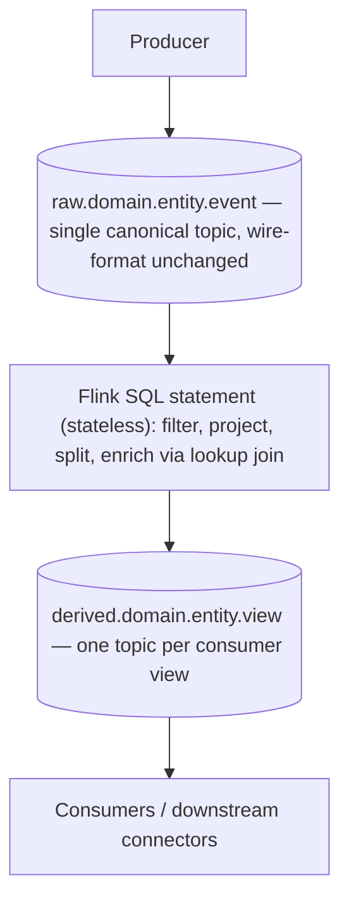

# Flink Event Routing — Raw Topic, Flink Statement, Derived Topic

## Summary

Canonical pipeline shape for event routing on Confluent Cloud: **producer writes the raw event verbatim → a Flink SQL statement filters/projects/splits → one or more derived topics that downstream consumers actually read**. Three load-bearing reasons to prefer this over producer-side filtering or fan-out: (1) **replayability** — derived topics are reproducible by re-running the Flink statement from `scan.startup.mode=earliest-offset`, (2) **schema decoupling** — consumers don't share a schema with whatever shape the producer happens to emit, (3) **debuggability** — the raw topic is preserved as ground truth even after the routing logic changes. The Flink layer is almost always stateless (`SELECT ... WHERE ...`, splits, `INSERT INTO` to a new topic), so the cost is dominated by parallelism × throughput, not state — making this one of the cheapest patterns to run on CC Flink. The anti-pattern this article counters is **pre-filtering or routing inside the producer** (Connect SMTs, app-side branching, Debezium predicates) — convenient for "just one consumer" but corrosive at scale.

This article describes the framework-level routing pattern. For the specific CDC variant — Debezium → raw → Flink decode → clean → Tableflow — see [CDC to Tableflow — Flink Decode Pattern](cdc-to-tableflow-flink-decode.md).

## Pattern

### Pipeline shape



The raw topic is the **system of record** for the event stream. Every derived topic is a deterministic function of the raw topic plus the Flink statement. If you delete a derived topic you can always reconstruct it; if you delete the raw topic you can't.

### When the Flink layer is stateless

The vast majority of routing work — filter, projection, split, enrichment via lookup join — is **stateless or bounded-state**. That means:

- No state TTL to set (no unbounded regular joins, no non-windowed aggregations — see [Flink Runtime Models](flink-runtime-models.md) for the state-TTL gotcha that bites stateful pipelines).
- CFU burn on CC Flink is dominated by source throughput × parallelism, not by state.
- Statements can be deleted and recreated at will without losing correctness (replay rebuilds the derived topic from `scan.startup.mode=earliest-offset`).

Operators that **keep** the routing layer stateless:

| Operator | State profile | OK for routing? |
|---|---|---|
| `SELECT ... WHERE ...` (filter) | stateless | yes — canonical case |
| Column projection (`SELECT a, b, c`) | stateless | yes |
| Computed columns (`UPPER(x)`, `CAST`, arithmetic) | stateless | yes |
| `JSON_VALUE` / `JSON_QUERY` decode | stateless | yes |
| `LATERAL TABLE(...)` unnest | stateless | yes |
| **Lookup join** against a small reference table | bounded (cache) | yes — preferred over regular join |
| **Temporal (versioned-table) join** | bounded | yes for slowly-changing dimensions |
| Regular join (two changelog streams) | **unbounded without TTL** | **no for routing** — push to a stateful pipeline |
| `GROUP BY` without window | **unbounded without TTL** | **no for routing** |
| `COUNT(DISTINCT ...)` | **unbounded high-cardinality** | **no for routing** |

If a routing requirement forces a regular join or non-windowed aggregation, that's no longer a routing statement — it's a stateful pipeline and inherits all the [state-TTL caveats](flink-runtime-models.md#caveats).

### Splitting one topic into many

The canonical fan-out shape — one raw topic feeding several derived topics with different predicates — is **one `INSERT INTO` statement per derived topic**, all reading the same source table:

```sql
-- Split by event type into typed derived topics
INSERT INTO `derived.payments.transaction.completed`
SELECT `txn_id`, `customer_id`, `amount`, `currency`, `event_time`
FROM   `raw.payments.transaction.envelope`
WHERE  `event_type` = 'completed';

INSERT INTO `derived.payments.transaction.refunded`
SELECT `txn_id`, `original_txn_id`, `amount`, `currency`, `refund_reason`, `event_time`
FROM   `raw.payments.transaction.envelope`
WHERE  `event_type` = 'refunded';

INSERT INTO `derived.payments.transaction.flagged`
SELECT `txn_id`, `customer_id`, `amount`, `risk_score`, `event_time`
FROM   `raw.payments.transaction.envelope`
WHERE  `event_type` = 'completed'
  AND  `risk_score` > 80;
```

Each `INSERT` runs as an **independent continuous statement** with its own lifecycle, its own resource footprint, and its own derived topic schema. This is exactly the [multi-event-topic splitting pattern](cdc-to-tableflow-flink-decode.md#pattern-7--multi-event-topics) from the CDC playbook, generalized.

### Output topic shape

- **Naming** — derived topics follow the same `<domain>.<application>.<version>.<entity>` convention as raw topics (see [Topic Naming Convention](topic-naming.md)). Add a `derived.` or `view.` prefix only if the team has a convention for distinguishing system-of-record from materialized views.
- **Schema** — registered up-front in Schema Registry via CI (`auto.register.schemas=false` per [Schema Registry Best Practices](../concepts/schema-registry-best-practices.md)). The derived schema is allowed to be much smaller than the raw schema; that's the entire point.
- **Compatibility** — `BACKWARD` for read-mostly views, `FULL` if multiple producers (re-runs from different statement versions) might write to it during a rollover. See [Schema Evolution Strategies](../concepts/schema-evolution-strategies.md) for the tier-based policy.
- **Changelog vs append** — `changelog.mode=append` for routing (no PRIMARY KEY in target). `changelog.mode=upsert` only when the derived topic is the materialized state of an upstream entity (then this becomes a [CDC decode pattern](cdc-to-tableflow-flink-decode.md), not a routing pattern).

### Sizing the compute pool for stateless routing

On CC Flink, stateless routing statements are the **cheap** workloads. Sizing heuristics:

- **CFU floor** — even a no-op statement reserves CFUs for parallelism + checkpoint workers. Plan for a 1-2 CFU floor per statement.
- **Throughput scaling** — a pure-filter `INSERT` at ~10 MB/s in / ~1-5 MB/s out typically sits well under 2 CFUs at default parallelism. Autopilot scales up if the source backs up.
- **Pool capacity** — one pool can host many routing statements. Practical limit is the per-pool `max_cfu` ceiling, not statement count.
- **What does NOT scale stateless routing** — record size (Flink decodes per row), wide projections with expensive functions (regex, JSON_VALUE on large payloads), and source parallelism (one task per Kafka partition; under-partitioned topics cap throughput).

> ⚠️ unverified — exact per-CFU throughput ceilings for stateless routing on CC Flink are not published as a hard number; the >2 CFU heuristic above is calibrated against the `flink-runtime-models` defaults but should be re-grounded against current `confluent-docs` if you're sizing for a customer-facing commitment.

For full compute-pool semantics (autopilot, `max_cfu` immutability after creation, region-scoped pools), see [Flink on Confluent Cloud Setup](../concepts/flink-confluent-cloud-setup.md).

### Replayability

The raw topic + the Flink statement text is the **only** persistent state needed to reconstruct any derived topic. To replay:

1. Delete the derived topic (or create a new one with `v2` suffix).
2. Recreate the target `CREATE TABLE` if columns changed.
3. Submit the `INSERT INTO` with `scan.startup.mode = 'earliest-offset'` (Confluent Canon default for deterministic replay).
4. Let it run to head-of-log; consumers cut over.

The raw topic's retention policy is what limits how far back you can replay. For event streams used as system-of-record this argues for **long retention** (event-time driven, often log-compacted for entity streams) on the raw topic and **shorter retention** (or even time-based with quick rollover) on derived topics that consumers can rebuild on demand.

## When to Use

- Any time more than one consumer reads (or might one day read) from the same producer.
- Whenever the producer's emit shape is dictated by an upstream system you don't control (CDC envelopes, third-party webhooks, mainframe message formats via MQ Source Connector).
- When you need to add a new consumer view without redeploying the producer — write a new Flink `INSERT` statement, register a new schema, ship.
- When the routing decision involves data from outside the event (lookup joins, reference tables, sanctions lists, risk-tier mappings).
- FSI: when regulators require **the entire unfiltered event stream to be preserved** for audit and replay, with downstream views being deterministic functions of that ground truth.

## Anti-Pattern — Pre-Filtering or Routing in the Producer

Doing the filter/projection inside the producer **looks** simpler (fewer hops, fewer topics, less Flink to operate) and is the path of least resistance for first-consumer-of-a-stream. It fails at the second or third consumer:

| What looks attractive | Why it breaks later |
|---|---|
| Connect SMT (`Filter`, `Cast`, `MaskField`, `RegexRouter`) on the source connector | One producer can only emit one filtered view. The next team wants a different filter; now you either deploy a second connector (paying ingest egress twice) or revisit the architecture under deadline pressure. |
| App-side branching (`if (x) producer.send(topic_a) else producer.send(topic_b)`) | Routing logic lives in production code, behind a deploy. Changing the routing requires a producer release, not a Flink statement update. |
| Debezium `transforms` predicates (skip-soft-deleted-rows, route-by-table-name) | Same as SMT — encoded once at capture time. If a new consumer needs the soft-deleted rows for audit, they can't be recovered. |
| Producer-side schema flattening (drop fields nobody asked for) | The dropped fields become irrecoverable. The next consumer that needs them must re-ingest from the source system — sometimes impossible (immutable upstream APIs, CDC log truncated). |
| Multiple producers writing pre-filtered slices to different topics | No single source-of-truth topic. Replay of a derived view across the whole event population is impossible. |

The principle: **keep producer-side logic to whatever is intrinsic to the wire format** (serialization, headers, partition key derivation). Anything that involves *deciding what a downstream consumer wants* belongs in Flink, not in the producer. The cost (one extra hop, derived topic storage) is a small price for replayability + decoupling.

The narrow exception: **PII redaction / tokenization at the source**, when the raw event must never land on a broker in cleartext. Even then, prefer **CSFLE at the Schema Registry layer** over producer SMT redaction (see [Schema Registry Best Practices](../concepts/schema-registry-best-practices.md)) — CSFLE keeps the raw topic recoverable for authorized consumers, where SMT-redaction destroys data permanently.

## Caveats

- **Don't route stateful workloads through this pattern without state TTL.** If the routing predicate involves a join on two changelog streams or a non-windowed aggregation, this is no longer a stateless routing pipeline — it inherits all the [state-TTL caveats](flink-runtime-models.md#caveats) and must size CFUs accordingly.
- **EOS across the hop is not free.** End-to-end exactly-once from raw → derived requires (a) the producer running with `enable.idempotence=true` and (acks=all), (b) Flink's two-phase commit checkpointing (default on CC Flink), (c) downstream consumers reading with `isolation.level=read_committed`. See [Exactly-Once Semantics](../concepts/exactly-once-semantics.md) for the full chain.
- **Retention asymmetry** — raw topic retention must outlast the longest replay window any downstream consumer might need. Setting raw retention shorter than derived retention defeats the replay guarantee silently.
- **Schema Registry IDs are not portable across environments.** A derived topic in `dev` has different schema IDs from the same topic in `prod`. CI-time registration is the source of truth, not runtime auto-registration. See [Schema Registry Best Practices](../concepts/schema-registry-best-practices.md).
- **CC Flink is SQL + Table API only.** If you need DataStream API for routing (custom partitioners, side outputs, low-level operator state), use [CMF on CFK or self-managed Flink](flink-runtime-models.md) — not CC Flink.
- **One `INSERT` per derived topic** — there's no `INSERT INTO ... PARTITIONED BY ... FAN OUT` in Flink SQL. Each derived topic is its own statement, with its own lifecycle and its own CFU footprint. For dozens of routing targets this can mean dozens of statements per pool; plan the pool count accordingly.
- **Don't read producer-side filtering as "wrong" universally.** A single-consumer telemetry stream where the producer and consumer are owned by the same team and replay is irrelevant — producer-side filtering is fine and saves a hop. The anti-pattern bites when the system grows past one consumer.

## Related

- [Flink Runtime Models — CC Managed, CMF, and Self-Managed](flink-runtime-models.md) — runtime context, state-TTL gotcha, watermark idleness
- [Flink on Confluent Cloud — Setup, RBAC, Lifecycle, and Statement Evolution](../concepts/flink-confluent-cloud-setup.md) — compute pools, statement lifecycle, autopilot
- [CDC to Tableflow — Flink Decode Pattern](cdc-to-tableflow-flink-decode.md) — specific instance of routing for CDC pipelines (raw envelope → clean topic → Tableflow)
- [Kafka Connect Deployment Models](connect-deployment-models.md) — where SMT routing lives in the alternative architecture
- [Topic Naming Convention](topic-naming.md) — raw vs derived topic naming
- [Schema Registry Best Practices](../concepts/schema-registry-best-practices.md) — CI-time registration, CSFLE, compatibility
- [Schema Evolution Strategies](../concepts/schema-evolution-strategies.md) — derived-topic compatibility selection
- [Exactly-Once Semantics](../concepts/exactly-once-semantics.md) — EOS across the producer → Flink → consumer chain
- [Flink Checkpointing](../concepts/flink-checkpointing.md) — two-phase commit for the hop
