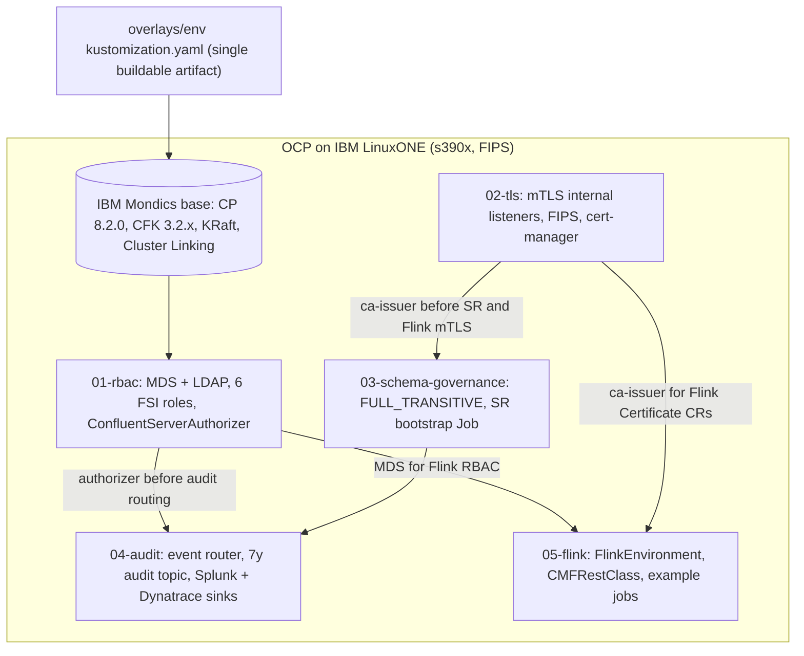

# LinuxONE-on-CFK Reference Architecture

## Summary

FSI-hardened Confluent Platform on Red Hat OpenShift on IBM LinuxONE / s390x.
Composes the IBM Matt Mondics reference implementation (CP 8.2.0 + CFK 3.2.x +
KRaft + Cluster Linking) as a fetched base with five GoodLabs FSI hardening
layers — RBAC, mTLS, Schema Registry governance, audit logging, Flink stream
processing — wired in as Kustomize Components on top. The result is one buildable
artifact per environment (`overlays/{dev,prod}/kustomization.yaml`) that yields a
production-grade hardened CP on LinuxONE with each control independently validated.



Source of truth: `fsi-dsp://accelerator/confluent-on-linuxone` (DESIGN.md, README.md,
RUNBOOK.md, KNOWN-GAPS.md, MIGRATION.md). Decision-level rationale: `fsi-dsp://adr/009`
(LinuxONE deployment guidance — IBM Semeru, PKCS12, CPACF).

## Provenance

| Component | Origin | What it provides |
|-----------|--------|------------------|
| Base CP manifests | IBM / Matt Mondics (`mmondics/Confluent-LinuxONE-Mirror`, 2026-05-20) | CP 8.2.0 CFK CRs, KRaft mode, Cluster Linking, KafkaRestClass, producer-app sample |
| `layers/01-rbac/` | GoodLabs | MDS RBAC with LDAP, 6 FSI role bindings, ConfluentServerAuthorizer |
| `layers/02-tls/` | GoodLabs | mTLS on all internal listeners, FIPS mode, cert-manager integration |
| `layers/03-schema-governance/` | GoodLabs | FULL_TRANSITIVE compatibility, SR bootstrap Job, hard-delete RBAC enforcement |
| `layers/04-audit/` | GoodLabs | Audit event routing, 7y-retention audit topic, Splunk + Dynatrace sinks |
| `layers/05-flink/` | GoodLabs | Flink stream processing: FlinkEnvironment, CMFRestClass, mTLS, RBAC, FSI example jobs |

Upstream is **never vendored** — `base/fetch-upstream.sh` clones the Mondics repo
at a pinned SHA into a gitignored `base/upstream/` directory at activation time.
See `ATTRIBUTION.md` for the credit and license-gap rationale, and KNOWN-GAPS.md
G-01 for the network-access requirement this implies (relevant to air-gapped CI).

## Composition mechanism — Kustomize Components

Each `layers/NN-*/kustomization.yaml` is `kind: Component`
(`kustomize.config.k8s.io/v1alpha1`) — a non-buildable fragment carrying that
layer's `patches:` and `resources:`. `overlays/{dev,prod}/kustomization.yaml` is
the single buildable `kind: Kustomization`:

```yaml
resources:
  - ../../base
components:
  - ../../layers/01-rbac
  - ../../layers/02-tls
  - ../../layers/03-schema-governance
  - ../../layers/04-audit
  - ../../layers/05-flink
```

Components apply **in listed order**, which encodes the dependency graph:

1. **01-rbac** — must register `ConfluentServerAuthorizer` before audit routing fires
2. **02-tls** — TLS secrets and `confluent-ca-issuer` must exist before MDS references them and before SR bootstrap / Flink mTLS Certificate CRs consume them
3. **03-schema-governance** — depends on layer-02 mTLS'd SR endpoint
4. **04-audit** — depends on layer-01 authorizer (audit events emitted by `ConfluentServerAuthorizer`)
5. **05-flink** — last; depends on layer-01 MDS (Flink RBAC) and layer-02 `confluent-ca-issuer` (Flink mTLS Certificate CRs)

Layer 05 is **resources-only** (no `patches:` block). Flink is a Kafka client —
it adds new CRs rather than patching existing ones. Per-overlay sizing
(parallelism, checkpoint interval, retention) is handled by `patches:` blocks in
`overlays/{dev,prod}/kustomization.yaml` so the same components produce different
operational shapes per environment.

## CFK CRD JSON-merge gotcha

CFK CRs are not strategic-merge-annotated → Kustomize uses **JSON-merge** (list
fields replace, not append). Mitigation: each layer owns a **distinct CR field**:

| Layer | CR field owned |
|-------|----------------|
| 01-rbac | `spec.authorization`, `spec.services.mds` |
| 02-tls | `spec.tls` |
| 03-schema-governance | SR `configOverrides.server` (subject-naming, compatibility) |
| 04-audit | `confluent.security.event.router.config` on Kafka CR |
| 05-flink | new CRs (FlinkEnvironment, FlinkApplication, CMFRestClass) — no patches |

Where two layers must both write `configOverrides.server`, consolidate into one
layer or use JSON6902 `add` patches. Prefer first-class CR fields over raw
`configOverrides` to keep patches non-colliding.

## Reuse Map — existing repo assets wired in

The accelerator is Kustomize/CRD-centric, but wires in existing GoodLabs assets
rather than duplicating them:

| Accelerator concern | Reused existing asset |
|---------------------|-----------------------|
| CFK operator install | `ansible/roles/cfk_operator` (readiness-gated) — RUNBOOK calls it instead of raw `helm install` |
| s390x base CR conventions | `scenarios/cfk-openshift-linuxone/values/kafka.yaml` (node affinity, FIPS) |
| CA + cert PEMs for `spec.tls.secretRef` | `LinuxOne/ansible-mtls/` + `ansible/roles/cp_mtls` mint CA/leaf PEMs → K8s cert secrets; cert-manager is the in-cluster rotation alternative |
| RBAC drift reconciliation | `ansible/roles/cp_rbac` LIST/DIFF/ADD/REMOVE pass over `ConfluentRolebinding` CRs (ops + CI) |
| SIEM dashboards/alerts | `observability/splunk/` + `observability/dynatrace/` — `layers/04-audit/siem/` references, no duplication |
| s390x decision rationale | `docs/adr/009-linuxone-deployment-guidance.md` — cross-linked from layer READMEs |

CFK manages all Confluent components; the Ansible roles act on the CFK-managed
cluster via MDS/Helm REST — no parallel broker management path.

## Per-layer one-line summary

- **01-rbac:** MDS + LDAP IdP boundary; 6 FSI roles (`platform-admin`,
  `topic-admin`, `producer-only`, `consumer-only`, `schema-admin`,
  `auditor-readonly`); `ConfluentServerAuthorizer` fires on every authz decision.
- **02-tls:** Per-component `spec.tls.secretRef` PEM secrets; mTLS on internal
  listeners; `spec.tls.fips.enabled: true` (no-op without OCP FIPS-at-install,
  see `concepts/fips-at-install-ocp-requirement`); cert-manager `ClusterIssuer` /
  `Certificate` for declarative rotation.
- **03-schema-governance:** `schema.compatibility.level=full_transitive` (prod);
  idempotent `restartPolicy: Never` bootstrap Job PUTs FULL_TRANSITIVE via REST.
- **04-audit:** `confluent.security.event.router.config` routes authn/authz/management
  events to `confluent-audit-log-events`; KafkaTopic CR pre-creates the topic with
  `retention.ms = 220752000000` (7y) prod / 30d dev; Connect CR + Splunk Sink + HTTP
  Sink → Dynatrace generic log ingest (no first-party Dynatrace connector — G-03).
- **05-flink:** `FlinkEnvironment` + `CMFRestClass` CRs; two example FlinkApplications
  (1-minute tumbling window TPS, account-transaction temporal stream-table join);
  mTLS via `confluent-ca-issuer` (no new PKI); `flink-developer` + three
  `flink-job-runtime-*` RBAC bindings; Flink's Kafka access audited automatically
  via layer-01 `ConfluentServerAuthorizer` (no layer-04 change required).

## Build and apply

```bash
cd accelerators/confluent-on-linuxone
flox activate                                            # fetches upstream
kustomize build overlays/prod | oc apply --dry-run=server -f - -n confluent
kustomize build overlays/prod | oc apply -f - -n confluent
```

Each layer has a `validate-*.sh` that asserts its specific control surface (RBAC
bindings, mTLS handshake, SR compatibility, audit topic continuity, Flink job
state). Cluster-dependent — not run in CI.

## FSI rationale

- **Mondics base alone is a demo**: no RBAC, no audit logging, Connect commented out, `autoGeneratedCerts` TLS. Production unsuitable for an FSI institution by construction.
- **CFK 3.2.0+ on s390x officially supports only Flink Applications** (KNOWN-GAPS G-11). Layers 01–04 are run-at-your-own-risk on s390x and are present as the FSI hardening on top of Mondics's working CP-on-s390x reference. Layer 05 is the officially supported path.
- **One buildable artifact per environment** keeps audit-grade reproducibility: every applied YAML is `kustomize build overlays/{env}` of an audited tree at a known SHA.

## Related

- `concepts/fsi-data-streaming-platform` — the platform context this accelerator targets
- `concepts/linuxone-kafka-integration` — LinuxONE-as-compute foundations underneath the accelerator
- `concepts/linuxone-platform-foundations` — s390x platform-level rationale (Telum II, CPACF, SMC-R)
- `patterns/auditor-readonly-rbac-payload-isolation` — layer 01 canonical RBAC pattern
- `patterns/flink-on-cfk-fsi-example-jobs` — layer 05 canonical Flink pattern
- `concepts/fips-at-install-ocp-requirement` — layer 02 OCP install dependency
- `concepts/s390x-custom-image-build-pipeline` — layer 04 / layer 05 image build pipeline

## Provenance

- DESIGN.md L41–69 (directory structure + Kustomize Component composition)
- DESIGN.md L93–103 (Reuse Map)
- DESIGN.md L107–200 (5 layer details)
- README.md L11–21 (provenance table — IBM upstream vs GoodLabs)
- KNOWN-GAPS G-11 (CFK s390x support scope) ⚠️ informational, not a runtime gap
