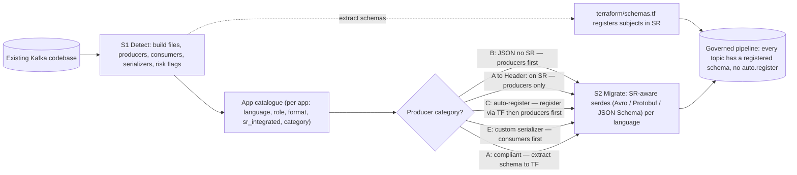

# Schema Registry Adoption Playbook

## Summary

End-to-end playbook for bringing an existing Kafka codebase onto Confluent Schema Registry: first **detect** every SR-missing surface (build files, producers, consumers, custom serializers, risk flags), then **migrate** the code to SR-aware serdes (Avro, Protobuf, or JSON Schema) with the right rollout order. Pairs detection patterns (what to grep for, per language) with migration recipes (the producer/consumer code to actually paste, per language and per format). Output is a fully governed pipeline where every topic has a registered schema, no producer uses `auto.register.schemas=true`, and rollout order is correct for each producer category.

Sourced from `confluentinc/agent-skills@91d1871e` (Apache-2.0) — upstream maintains an eval gate at 90%+ pass before merge, so this article is `confidence: high` via source attestation rather than per-claim MCP re-validation. Trip-wire micro-articles in `wiki/concepts/` carry full MCP validation.

## Pattern



### Section 1 — Detection patterns

The detection phase runs first. Goal: produce an app catalogue with every Kafka producer/consumer in the codebase, classified by serializer family (Avro/Protobuf/JSON Schema/raw/custom), SR-integration status, and risk flags (`auto.register.schemas=true`, `use.latest.version=true`).

#### Build files and dependencies

Glob patterns:

```
**/pom.xml
**/build.gradle
**/build.gradle.kts
**/requirements.txt
**/pyproject.toml
**/setup.py
**/setup.cfg
**/Pipfile
**/*.csproj
**/packages.config
**/Directory.Packages.props
**/go.mod
**/package.json
```

Dependency strings per language:

| Language | Dependency strings |
|---|---|
| Java | `spring-kafka`, `kafka-clients`, `kafka-streams`, `spring-cloud-stream`, `io.confluent`, `confluent-kafka` |
| Python | `confluent-kafka`, `confluent_kafka`, `kafka-python`, `faust-streaming`, `faust` |
| .NET | `Confluent.Kafka`, `Confluent.SchemaRegistry`, `Confluent.SchemaRegistry.Serdes` |
| Go | `confluent-kafka-go`, `github.com/Shopify/sarama`, `github.com/IBM/sarama`, `github.com/segmentio/kafka-go` |
| Node/TS | `kafkajs`, `node-rdkafka`, `@confluentinc/kafka-javascript`, `kafka-node` |

#### Producer detection

| Language | Patterns |
|---|---|
| Java | `KafkaTemplate`, `KafkaProducer`, `ProducerRecord`, `@SendTo`, `StreamBridge`, `ProducerFactory`, `KStream`, `KTable`, `StreamsBuilder`, `.to(`, `.through(` |
| Python | `Producer(`, `SerializingProducer(`, `AvroProducer(`, `.produce(`, `send(topic` |
| .NET | `ProducerBuilder`, `IProducer`, `ProduceAsync`, `.Produce(` |
| Go | `kafka.NewProducer`, `sarama.NewSyncProducer`, `sarama.NewAsyncProducer`, `kafka.NewWriter` |
| Node/TS | `producer.send(`, `kafka.producer(`, `producer.produce(`, `.sendBatch(` |

#### Consumer detection

| Language | Patterns |
|---|---|
| Java | `@KafkaListener`, `KafkaConsumer`, `ConsumerRecords`, `KafkaMessageListenerContainer`, `ConcurrentMessageListenerContainer` |
| Python | `Consumer(`, `DeserializingConsumer(`, `AvroConsumer(`, `.subscribe(`, `.poll(` |
| .NET | `ConsumerBuilder`, `IConsumer`, `.Consume(`, `ConsumerConfig` |
| Go | `kafka.NewConsumer`, `sarama.NewConsumerGroup`, `kafka.NewReader`, `.ReadMessage(` |
| Node/TS | `consumer.run(`, `kafka.consumer(`, `consumer.subscribe(`, `eachMessage` |

#### Serializer classification

Grep patterns:

```
key.serializer
value.serializer
key.deserializer
value.deserializer
KafkaAvroSerializer
KafkaJsonSchemaSerializer
KafkaProtobufSerializer
StringSerializer
ByteArraySerializer
JsonSerializer
AvroSerializer
ProtobufSerializer
HeaderSchemaIdSerializer
schema.registry.url
SchemaRegistryClient
CachedSchemaRegistryClient
```

Classification:

| Serializer found | Schema format | SR integrated? |
|---|---|---|
| `KafkaAvroSerializer` / `AvroSerializer` | AVRO | Yes |
| `KafkaJsonSchemaSerializer` / `JsonSchemaSerializer` | JSON | Yes |
| `KafkaProtobufSerializer` / `ProtobufSerializer` | PROTOBUF | Yes |
| `StringSerializer` + JSON data in code | JSON (infer) | No — flag for upgrade |
| `ByteArraySerializer` + Avro in code | AVRO (infer) | No — flag for upgrade |
| `JsonSerializer` (Spring default) | JSON (infer) | No — flag for upgrade |
| Custom serializer | Infer from code | No — flag for upgrade |
| No serializer / raw produce | JSON (infer) | No — flag for upgrade |

#### Custom serializer detection (per language)

**Java** — implementations of `org.apache.kafka.common.serialization.Serializer<T>`. Look for classes with a `serialize(String topic, ...)` method that use `ObjectMapper`/`Gson`/`Jackson`/`org.json` (→ JSON format), `GenericDatumWriter`/`SpecificDatumWriter`/`BinaryEncoder` (→ AVRO), `com.google.protobuf`/`toByteArray()` (→ PROTOBUF) — and do NOT reference `schema.registry.url` or `SchemaRegistryClient`.

**Python** — `def serializer(...)`, `def serialize(...)`, `def value_serializer(...)`, `json.dumps` + produce, `msgpack.pack`, `pickle.dumps`, `fastavro`/`avro.io` (→ AVRO), `protobuf` (→ PROTOBUF).

**.NET** — `ISerializer<...>`, `IAsyncSerializer<...>`, `JsonConvert.SerializeObject`, `System.Text.Json.JsonSerializer.Serialize`, `Avro.IO`, `Google.Protobuf`.

**Go** — `json.Marshal`, `json.NewEncoder`, `proto.Marshal`, `goavro`, `avro.Marshal`, `avro.NewCodec`.

**Node/TS** — `JSON.stringify` + send, `Buffer.from` + JSON, `serialize` + value.

#### Risk detection

`auto.register.schemas=true`:

```
auto.register.schemas\s*=\s*true
auto\.register\.schemas.*true
AutoRegisterSchemas\s*=\s*true
auto_register_schemas.*True
autoRegisterSchemas.*true
```

`use.latest.version`:

```
use.latest.version\s*=\s*true
use\.latest\.version.*true
UseLatestVersion\s*=\s*true
```

Files to prioritise:

```
**/*.properties
**/*.yml
**/*.yaml
**/application*.properties
**/application*.yml
**/*.java
**/*.py
**/*.cs
**/*.go
**/*.ts
**/*.js
**/*.json
```

#### Producer categorization

Classify each producer; the category drives the rollout order.

| Category | Criteria | Action |
|---|---|---|
| **A: Compliant** | Uses Confluent serializer + `schema.registry.url` configured + no `auto.register` | Report as compliant. Still extract schema to Terraform if not already IaC-managed. |
| **A→Header: Already on SR, migrating to headers** | Uses Confluent serializer + SR; wants schema ID from payload prefix moved to Kafka headers | No schema extraction needed. Add `HeaderSchemaIdSerializer` to producers. Consumers need no changes — Confluent deserializers auto-check both locations. |
| **B: Schema in code, no SR** | Has data models/classes but uses `StringSerializer` / `JsonSerializer` (Spring) / raw kafka-python / kafkajs raw | Extract schema → `terraform/schemas.tf` + upgrade recommendation. |
| **C: Auto-register** | Has `auto.register.schemas=true` | Extract schema → `terraform/flagged-auto-register.tf` (commented out) + flag risk. |
| **D: No schema** | Raw strings/bytes, no discernible data model, hardcoded JSON | Flag in report; recommend schema-first approach. |
| **E: Custom serializer** | Implements `Serializer<T>`, uses `json.dumps`/`JSON.stringify`/`JsonConvert`/`json.Marshal`/`GenericDatumWriter` inline — all without SR | Extract schema from data model → `terraform/schemas.tf` + recommend replacing with Confluent serializer. |

App catalogue YAML per Kafka application:

```yaml
app_name: directory or module name
language: Java | Python | .NET | Go | Node/TS
role: producer | consumer | both
topics: [list of topic names]
serializer_class: the value.serializer being used
custom_serializer: true | false
custom_serializer_file: file:line where defined
schema_format: AVRO | JSON | PROTOBUF | UNKNOWN
sr_integrated: true | false
sr_url: schema registry URL if configured
auto_register: true | false
category: A | B | C | D | E
```

#### Rollout order by category

- **Category B (JSON, no SR) — Producers First.** Consumers today read raw JSON and ignore headers. Upgrade producers to Confluent serializer + `HeaderSchemaIdSerializer`, then upgrade consumers to Confluent deserializer (auto-detects schema-ID location).
- **Category A→Header (Already on SR) — Producers Only.** Consumers already use Confluent deserializers and auto-check headers first on supported versions (Java 8.1.1+, Python 2.13.0+, etc.). Just upgrade producers with `HeaderSchemaIdSerializer`.
- **Category C (Auto-register) — Producers First.** Register schemas via Terraform → set `auto.register.schemas=false` in producer config → set `use.latest.version=true`.
- **Category E (Custom serializers) — Consumers First.** Payload format changes when replacing custom serializers. Upgrade consumers first (Java: composite deserializer; others: coordinated cutover) → upgrade producers with Confluent + `HeaderSchemaIdSerializer` → after old data expires, remove composite deserializer.

Minimum client versions for header-based schema ID:

- Java CP client ≥ 8.1.1
- C/C++ libserdes ≥ 0.1.0
- Python `confluent-kafka` ≥ 2.13.0
- .NET `Confluent.Kafka` ≥ 2.13.0
- Go `confluent-kafka-go` ≥ 2.13.0
- Node.js `@confluentinc/kafka-javascript` ≥ 1.8.0

---

### Section 2 — Code migration

After detection, migrate each producer/consumer to SR-aware serdes. Choose Avro, Protobuf, or JSON Schema based on use case.

#### Format selection

| Format | Best for | Pros | Cons |
|---|---|---|---|
| **Avro** | High-throughput data pipelines, analytics | Compact binary, rich schema evolution, fast | Code generation required; less readable |
| **Protobuf** | Microservices, gRPC, cross-language | Compact, widely adopted, strong typing | Code generation required; steeper learning curve |
| **JSON Schema** | Web APIs, gradual migration, readability | Human-readable, no codegen, familiar | Larger payload, slower serialization |

**Recommendation:** Avro for data-intensive pipelines, Protobuf for service-to-service, JSON Schema for gradual migrations from plain JSON.

#### Migration workflow

1. Review the schema report — identify apps needing migration.
2. For each app, determine language and role (producer/consumer).
3. Choose the schema format.
4. Update dependencies to include SR client libraries.
5. Replace existing serializers/deserializers with SR-aware versions.
6. Update configuration with SR connection details.
7. Test with schemas in the `schemas/` directory (generated during detection).

#### Python — Avro

```python
# requirements.txt: confluent-kafka[avro]

from confluent_kafka.schema_registry.avro import AvroSerializer, AvroDeserializer

# Producer
avro_serializer = AvroSerializer(schema_registry_client, schema_string, value_to_dict)
producer.produce(
    topic=topic,
    value=avro_serializer(value_obj, SerializationContext(topic, MessageField.VALUE))
)

# Consumer
avro_deserializer = AvroDeserializer(schema_registry_client, schema_str, dict_to_value)
msg = consumer.poll(1.0)
value_obj = avro_deserializer(msg.value(), SerializationContext(msg.topic(), MessageField.VALUE))
```

Protobuf and JSON Schema follow the same shape with `ProtobufSerializer`/`ProtobufDeserializer` and `JSONSerializer`/`JSONDeserializer` from `confluent_kafka.schema_registry.protobuf` and `.json_schema`.

#### Java — Avro

```xml
<!-- pom.xml -->
<dependency>
    <groupId>io.confluent</groupId>
    <artifactId>kafka-avro-serializer</artifactId>
</dependency>
```

```java
import io.confluent.kafka.serializers.KafkaAvroSerializer;
import io.confluent.kafka.serializers.KafkaAvroDeserializer;

// Producer
props.put(ProducerConfig.VALUE_SERIALIZER_CLASS_CONFIG, KafkaAvroSerializer.class.getName());
KafkaProducer<String, YourAvroModel> producer = new KafkaProducer<>(props);
YourAvroModel value = new YourAvroModel(...);
producer.send(new ProducerRecord<>(topic, key, value));

// Consumer
props.put(ConsumerConfig.VALUE_DESERIALIZER_CLASS_CONFIG, KafkaAvroDeserializer.class.getName());
Consumer<String, YourAvroModel> consumer = new KafkaConsumer<>(props);
while (true) {
    ConsumerRecords<String, YourAvroModel> records = consumer.poll(Duration.ofMillis(100));
    for (ConsumerRecord<String, YourAvroModel> record : records) {
        YourAvroModel value = record.value();
    }
}
```

Protobuf uses `KafkaProtobufSerializer` / `KafkaProtobufDeserializer` and **requires** `KafkaProtobufDeserializerConfig.SPECIFIC_PROTOBUF_VALUE_TYPE` to get typed messages (otherwise `DynamicMessage`). JSON Schema uses `KafkaJsonSchemaSerializer` / `KafkaJsonSchemaDeserializer` with `KafkaJsonSchemaDeserializerConfig.JSON_VALUE_TYPE` (otherwise `LinkedHashMap` casts).

#### JavaScript / Node.js

```json
{
  "dependencies": {
    "@confluentinc/kafka-javascript": "latest",
    "@confluentinc/schemaregistry": "latest",
    "protobufjs": "latest"
  }
}
```

```javascript
const { SchemaRegistryClient, SerdeType, AvroSerializer, AvroDeserializer }
  = require("@confluentinc/schemaregistry");

// Producer
const serializer = new AvroSerializer(srClient, SerdeType.VALUE, { useLatestVersion: true });
const message = { value: await serializer.serialize("your-topic", { field1: "value1", field2: 123 }) };

// Consumer
const deserializer = new AvroDeserializer(srClient, SerdeType.VALUE, {});
consumer.run({
  eachMessage: async ({ topic, message }) => {
    const decoded = await deserializer.deserialize(topic, message.value);
  }
});
```

Protobuf and JSON Schema use `ProtobufSerializer`/`ProtobufDeserializer` and `JsonSerializer`/`JsonDeserializer` from the same package.

#### Go

```go
import (
    "github.com/confluentinc/confluent-kafka-go/v2/schemaregistry"
    "github.com/confluentinc/confluent-kafka-go/v2/schemaregistry/serde"
    "github.com/confluentinc/confluent-kafka-go/v2/schemaregistry/serde/avrov2"
)

// Producer
ser, _ := avrov2.NewSerializer(client, serde.ValueSerde, avrov2.NewSerializerConfig())
value := YourStruct{Field1: "value1", Field2: 123}
payload, _ := ser.Serialize(topic, &value)
producer.Produce(&kafka.Message{
    TopicPartition: kafka.TopicPartition{Topic: &topic, Partition: kafka.PartitionAny},
    Value:          payload,
}, deliveryChan)

// Consumer
deser, _ := avrov2.NewDeserializer(client, serde.ValueSerde, avrov2.NewDeserializerConfig())
switch e := event.(type) {
case *kafka.Message:
    value := YourStruct{}
    deser.DeserializeInto(*e.TopicPartition.Topic, e.Value, &value)
}
```

Protobuf and JSON Schema use `protobuf.NewSerializer` and `jsonschema.NewSerializer` from `schemaregistry/serde/protobuf` and `schemaregistry/serde/jsonschema`.

#### .NET / C#

```xml
<PackageReference Include="Confluent.SchemaRegistry.Serdes.Avro" />
```

```csharp
using Confluent.Kafka;
using Confluent.SchemaRegistry;
using Confluent.SchemaRegistry.Serdes;

// Producer
using var schemaRegistry = new CachedSchemaRegistryClient(schemaRegistryConfig);
using var producer = new ProducerBuilder<string, YourAvroModel>(producerConfig)
    .SetValueSerializer(new AvroSerializer<YourAvroModel>(schemaRegistry))
    .Build();
await producer.ProduceAsync(topic, new Message<string, YourAvroModel>
    { Key = key, Value = new YourAvroModel { Field1 = "value1", Field2 = 123 } });

// Consumer
using var consumer = new ConsumerBuilder<string, YourAvroModel>(consumerConfig)
    .SetValueDeserializer(new AvroDeserializer<YourAvroModel>(schemaRegistry).AsSyncOverAsync())
    .Build();
consumer.Subscribe("your-topic");
while (true) {
    var consumeResult = consumer.Consume();
    var value = consumeResult.Message.Value;
}
```

Protobuf and JSON Schema follow the same pattern with `ProtobufSerializer<T>` / `ProtobufDeserializer<T>` and `JsonSerializer<T>` / `JsonDeserializer<T>`.

#### Migration testing checklist

- [ ] Verify schema files in `schemas/` match data models.
- [ ] Apply Terraform to register schemas in SR.
- [ ] Test producer serialization with sample data.
- [ ] Test consumer deserialization with existing topic data.
- [ ] Verify PII fields are tagged (see [Schema Inference and PII Categorization](../concepts/schema-inference-and-pii-categorization.md)).
- [ ] Update CI/CD to include schema validation.
- [ ] Document rollout order (consumers first for Category E, producers first for Category B).
- [ ] Plan rollback strategy (keep old serializers initially).
- [ ] Monitor schema compatibility errors in SR.
- [ ] Update alerting for serialization failures.

#### Common migration issues

| Symptom | Fix |
|---|---|
| Serialization/deserialization errors | Ensure data model matches generated schema exactly (field names, types, nullability). |
| 401/403 connecting to SR | Verify SR API key/secret and ACLs on the subject. |
| "Schema being registered is incompatible" | Check SR compatibility mode. `BACKWARD` for consumers-first; `FORWARD` for producers-first. |
| Increased latency after migration | Enable schema caching (most clients auto-cache; verify config). |
| Deserializer cannot find schema | Ensure producer is actually using the Confluent serializer, not a custom fallback. |

## When to Use

- Greenfield project — establish SR adoption discipline from day one.
- Brownfield codebase being moved onto Confluent Cloud — detect SR-missing surfaces before cutover.
- Mixed-format estate (some apps SR-aware, others raw JSON) — bring everything into compliance with a structured rollout.
- FSI engagements where governance and audit trail mandate every topic having a registered schema.

## Caveats

- **`auto.register.schemas=true` is a governance bypass and a race condition.** Two producer instances can register slightly different "latest" schemas at the same time. Always register schemas in CI via Terraform.
- **Custom serializers in Category E require coordinated cutover.** Payload format changes when replacing the serializer. Plan a composite-deserializer phase on the consumer side, then producer migration, then remove the composite.
- **`HeaderSchemaIdSerializer` requires minimum client versions on consumers.** Java ≥ 8.1.1, Python ≥ 2.13.0, .NET ≥ 2.13.0, Go ≥ 2.13.0, Node.js ≥ 1.8.0. Older clients can't auto-detect header-based schema IDs.
- **Schema IDs are NOT portable across environments.** Dev ID 100 ≠ Prod ID 100. Use Schema Linking, export/import, or pinned subject references — never hardcode IDs.
- **JSON Schema partial schemas are fine for JSON_SR topics.** Avro and Protobuf MUST define the complete schema matching payload structure (binary formats can't decode partials).
- **Don't forget PII categorization.** Schema inference is only half the picture — sensitive fields need `confluent:tags` annotations for CSFLE and downstream governance. See [Schema Inference and PII Categorization](../concepts/schema-inference-and-pii-categorization.md).

## Related

- [Schema Registry Best Practices](../concepts/schema-registry-best-practices.md) — operational surface for SR (subject strategy, compatibility, IDs)
- [Schema Evolution Strategies](../concepts/schema-evolution-strategies.md) — tier-based compatibility, evolution runbook
- [FSI Governance Automation](fsi-governance-automation.md) — Terraform enforcement of registered subjects
- [Schema Registry Shared-Types Library](schema-registry-shared-types.md) — versioned shared types via SR references
- [Schema Inference and PII Categorization](../concepts/schema-inference-and-pii-categorization.md) — inference + PII tagging sibling

---

*Source: confluentinc/agent-skills@91d1871e · skills/kafka-schema-registry/references/{detection-patterns,code-migration}.md · Ingested 2026-05-16 · Apache-2.0*
