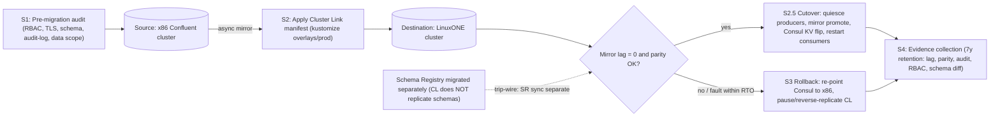

# x86 to LinuxONE Cluster Linking Migration

## Summary

End-to-end FSI procedure for migrating an existing x86 Confluent cluster to IBM
LinuxONE via Cluster Linking. Wraps the upstream Mondics Cluster Linking pattern
(`base/upstream/clusterlink.yaml`) with the four FSI-grade procedures regulatory
review requires: pre-migration audit posture verification, in-flight data
validation (mirror lag, end-offset parity, schema parity), rollback within RTO,
and post-migration evidence collection retained for 7 years (OFAC/AML).

Architectural decision rationale: `fsi-dsp://adr/005` (Cluster Linking over MM2 /
MRC for Confluent-to-Confluent migration). This article is the operational
procedure that ADR-005 governs.



## Section 1 — Pre-migration audit checklist (source x86 cluster)

A control gap on the source propagates to the destination. Validate both ends
before establishing the link.

### 1.1 RBAC posture

```bash
confluent iam rbac role-binding list --kafka-cluster-id <SOURCE_CLUSTER_ID>

# Verify no wildcard DeveloperRead bindings exist
confluent iam rbac role-binding list \
  --kafka-cluster-id <SOURCE_CLUSTER_ID> \
  --role DeveloperRead | grep -v "PREFIXED\|LITERAL"
```

Expected: no wildcard role bindings; `auditor-readonly` scoped to
`confluent-audit-log-events` only (see `patterns/auditor-readonly-rbac-payload-isolation`).

### 1.2 TLS posture

```bash
openssl s_client -connect <SOURCE_BOOTSTRAP>:9092 2>&1 | grep -E "Protocol|Cipher"
```

Expected: `Protocol: TLSv1.3` or `TLSv1.2`. TLS 1.0/1.1 must be remediated before
migration — traffic in flight during the link would use the weaker protocol.

### 1.3 Schema governance

```bash
curl -sf -u <SR_USER>:<SR_PASS> https://<SOURCE_SR_URL>/config | jq -r '.compatibility'
```

Expected: `FULL_TRANSITIVE` or at minimum `BACKWARD`. `NONE` means incompatible
schemas may exist; enumerate and remediate before linking.

### 1.4 Audit log coverage

```bash
confluent kafka topic consume confluent-audit-log-events \
  --bootstrap <SOURCE_BOOTSTRAP> --from-beginning --timeout-ms 5000 | wc -l
```

Expected: `> 0` messages. Source must have audit logging before migration or the
pre-migration audit trail will be incomplete.

### 1.5 Regulatory data scope

Document before migration:
- [ ] Topic list with retention policies (identify topics with >1y retention)
- [ ] Schema subjects in scope (`GET /subjects` export)
- [ ] Active consumer groups and committed offsets (will NOT migrate via CL)
- [ ] Active transactional producers (must be quiesced before cutover)

## Section 2 — Cluster Link establishment + in-flight validation

### 2.1 Apply the Cluster Link manifest

After `base/fetch-upstream.sh`, the CL CR is in `base/upstream/clusterlink.yaml`.
Update source endpoints, then apply:

```bash
kustomize build overlays/prod | oc apply -f - -n confluent
```

### 2.2 Monitor mirror lag

`MirrorLag` is the primary health indicator. Target: lag < 1 minute sustained;
cut over only when lag → 0 ms.

```bash
confluent kafka mirror describe --link <LINK_NAME> --cluster <DESTINATION_CLUSTER_ID>
```

### 2.3 Record-count parity (end-offsets)

```bash
confluent kafka topic describe <TOPIC_NAME> --bootstrap <SOURCE_BOOTSTRAP> | grep "End Offset"
confluent kafka topic describe <TOPIC_NAME> --bootstrap <DESTINATION_BOOTSTRAP> | grep "End Offset"
```

Expected: end offsets equal (or within a few messages if producers are still active).

### 2.4 Schema parity — explicit trip-wire

```bash
curl -sf -u <SR_USER>:<SR_PASS> https://<SOURCE_SR_URL>/subjects > /tmp/source-subjects.json
curl -sf -u <SR_USER>:<SR_PASS> https://<DEST_SR_URL>/subjects > /tmp/dest-subjects.json
diff /tmp/source-subjects.json /tmp/dest-subjects.json
```

**Trip-wire:** Schema Registry **DOES NOT** replicate via Cluster Linking.
Schemas must be migrated separately using the SR migration tool, or via the
Cluster Linking schema sync feature (CP 8.2+ with Schema Registry Cluster
Linking — ⚠️ unverified on s390x, see KNOWN-GAPS G-09).

### 2.5 Cutover

```bash
# 1. Stop all producers writing to source (coordinate with app teams)
# 2. Wait for mirror lag → 0
confluent kafka mirror describe --link <LINK_NAME> --cluster <DESTINATION_CLUSTER_ID>

# 3. Promote all mirror topics to writable on destination
confluent kafka mirror promote \
  --link <LINK_NAME> \
  --topics <TOPIC_CSV> \
  --cluster <DESTINATION_CLUSTER_ID>

# 4. Atomic endpoint flip via Consul KV (canonical pattern per ADR-003)
consul kv put fsi/kafka/active-region linuxone
consul kv put fsi/kafka/bootstrap <DESTINATION_BOOTSTRAP>

# 5. Restart consumers against destination
# 6. Verify consumer group lag = 0 on destination
confluent kafka consumer group describe <GROUP_NAME> --bootstrap <DESTINATION_BOOTSTRAP>
```

## Section 3 — Rollback procedure

Rollback within the RTO window documented in the DR plan (typically 15–30 minutes
before transactional state diverges).

1. **Stop producers on destination** — coordinate with app teams.
2. **Re-point consumers to source** via Consul KV:
   ```bash
   consul kv put fsi/kafka/active-region x86
   consul kv put fsi/kafka/bootstrap <SOURCE_BOOTSTRAP>
   ```
3. **Demote mirrored topics on destination** — pause the CL:
   ```bash
   confluent kafka mirror pause --link <LINK_NAME> --cluster <DESTINATION_CLUSTER_ID>
   ```
   If promotion was completed, **reverse-replicate**: create a new Cluster Link
   from destination (LinuxONE) back to source (x86) and let it catch up on any
   events produced to LinuxONE during the window.
4. **Validate source is receiving traffic** — `confluent kafka topic tail <TOPIC>`.
5. **Document the rollback event**: timestamp of cutover, timestamp of rollback,
   event volume produced to destination during the window, preliminary root
   cause (full RCA within 5 business days per FSI incident policy).

## Section 4 — Post-migration evidence collection (7y retention)

Regulators require demonstrable evidence that the migration met data integrity
and security controls. Collect and archive the following.

### 4.1 Mirror lag log
```bash
confluent kafka mirror describe \
  --link <LINK_NAME> --cluster <DESTINATION_CLUSTER_ID> --output json \
  > /tmp/migration-evidence/mirror-lag-at-cutover.json
```
Target: `MirrorLag: 0` at time of cutover. If non-zero, document the data window
and confirm all records arrived post-promotion via end-offset comparison.

### 4.2 Record-count comparison
```bash
confluent kafka topic list --bootstrap <SOURCE_BOOTSTRAP> --output json \
  > /tmp/migration-evidence/source-topics.json
confluent kafka topic list --bootstrap <DESTINATION_BOOTSTRAP> --output json \
  > /tmp/migration-evidence/dest-topics.json
```

### 4.3 Audit log continuity
```bash
confluent kafka topic consume confluent-audit-log-events \
  --bootstrap <DESTINATION_BOOTSTRAP> --from-beginning --print-key --timeout-ms 30000 \
  > /tmp/migration-evidence/audit-events-migration-window.jsonl
```

### 4.4 RBAC posture comparison
```bash
confluent iam rbac role-binding list \
  --kafka-cluster-id <DESTINATION_CLUSTER_ID> --output json \
  > /tmp/migration-evidence/dest-rbac-bindings.json
```
Diff against the source export from §1.1 — no role creep during migration.

### 4.5 Schema parity confirmation
```bash
diff /tmp/source-subjects.json /tmp/dest-subjects.json \
  > /tmp/migration-evidence/schema-parity-diff.txt || true
```
Expected: empty diff file.

### 4.6 Archive the evidence package
```bash
tar czf migration-evidence-$(date +%Y%m%d).tar.gz /tmp/migration-evidence/
# Store in your GRC tool / regulatory evidence system
# Retain for minimum 7 years (OFAC/AML) or per your FI's retention schedule
```

## Migration-evidence checklist

| Artifact | Purpose | Retention |
|----------|---------|-----------|
| `mirror-lag-at-cutover.json` | Data-integrity attestation | 7y |
| `source-topics.json` / `dest-topics.json` | Record-count parity | 7y |
| `audit-events-migration-window.jsonl` | Continuous audit trail | 7y |
| `dest-rbac-bindings.json` | RBAC posture preservation | 7y |
| `schema-parity-diff.txt` | Schema integrity attestation | 7y |
| Rollback decision log (if invoked) | Incident record | 7y |

## Related

- `concepts/cluster-linking-topology` — CL mechanism underlying the migration
- `patterns/dr-cluster-linking` — DR pattern using the same CL primitive
- `patterns/dr-mirrormaker2` — alternative replication backend (not preferred for CC→CC per ADR-005)
- `patterns/linuxone-on-cfk-reference-architecture` — the destination architecture being migrated to
- `synthesis/adr-index` — ADR-005 Cluster Linking decision

## Provenance

- MIGRATION.md §1–§4 (pre-migration audit, in-flight validation, rollback, evidence collection)
- `fsi-dsp://adr/005` (CL over MRC decision)
- KNOWN-GAPS G-09 (SR Cluster Linking schema sync s390x verification — pending)
